#### Use case - Fraud detection with [Intel® Distribution of Modin](https://www.intel.com/content/www/us/en/developer/tools/oneapi/distribution-of-modin.html#gs.7hvt6) and  [Intel® Extension for scikit-learn](https://www.intel.com/content/www/us/en/developer/tools/oneapi/scikit-learn.html#gs.iezgox)


# Table of Contents
1. [Section 1 : Pre-process](#section1)
	1.	[Check for missing values](#missing)
	2.	[Subsampling](#sub)
3. [Section 2 : Data transformation](#section2)
	1.	[Split Data](#split)
	2.	[Transformations](#trans)
	3. [Scaling](#scaling)
	4. [Outliers](#outliers)
	5. [Feature Engineering](#fe)
3. [Section 3 : Train Your Fraud Detection Model with Intel® Extension for scikit-learn](#section3)
	1.	[Algorithms](#algo)
	2.	[Model 1 : Logistic Regression](#trans)
	3. [Model 2 : Decision Trees](#scaling)
	4. [Conclusion](#outliers)
	5. [References](#fe)

First of all, you should install all the dependencies.

```python
# Use ! if you are running this line on jupyter, or remove it if you'll be using it on your terminal.
!pip install requirements.txt 
```
Let's move on now you have the dependencies installed

In this post, you’ll prepare and pre-process data with the [Intel® Distribution of Modin*] (https://www.intel.com/content/www/us/en/developer/tools/oneapi/distribution-of-modin.html#gs.7hvt6). You’ll also use an [anonymized dataset](https://www.kaggle.com/datasets/mlg-ulb/creditcardfraud) extracted from Kaggle.

The Intel® Distribution of Modin will help you execute operations faster using the same API as [pandas](https://pandas.pydata.org/). The library is fully compatible with the [pandas API](https://pandas.pydata.org/docs/reference/index.html). OmniSci powers the backend and provides accelerated analytics on Intel® platforms. (Here are [installation instructions](https://www.intel.com/content/www/us/en/developer/tools/oneapi/distribution-of-modin.html#gs.8blx9q).) 

Note: [Modin](https://modin.readthedocs.io/en/stable/) does not currently support distributed execution for all methods from the pandas API. The remaining unimplemented methods are executed in a mode called “default to pandas.” This allows users to continue using Modin even though their workloads contain functions not yet implemented in Modin. 
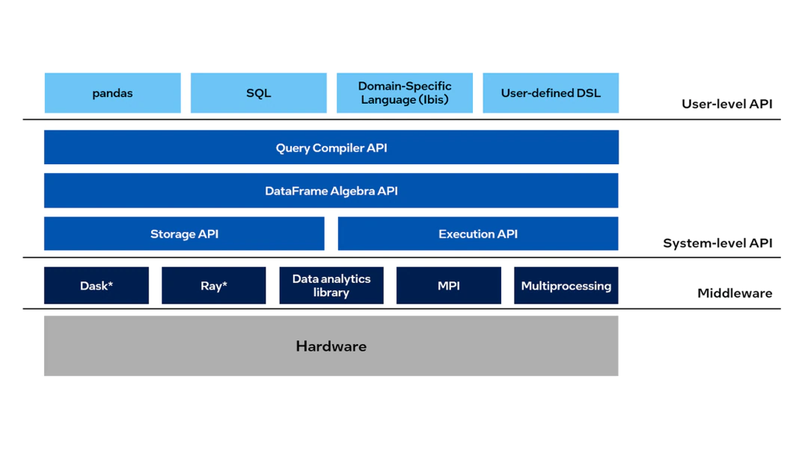

<a name="section1"></a>

## Section 1 : Pre-process and Initial Data Analysis 

The first step is to pre-process the data. After you download and extract the data, you’ll have it in spreadsheet format. That means you’ll work with tabular data where each row is a transaction (example) and each column is a feature (transaction amount, credit limit, age.) In this tutorial you won’t know which represents each feature, since the data has been anonymized for privacy purposes. This example uses supervised learning, meaning the algorithm is trained on a pre-defined set of examples. The examples are labeled with one column called LABEL (FRAUD or NOT FRAUD) 


In a real-world case, the data could come from multiple sources (such as SQL, Oracle Database* or Apache Spark*.) The idea is to have one spreadsheet file to put in the algorithm to train it. To do that, you need to concatenate or join multiple files to get one main dataset. Joining multiple sources can result in a main dataset with thousands of lines and hundreds of columns. Working with such a large file can strain on your computer/server for memory and processing, so it’s important to use optimized frameworks to speed up this task.

First, load the dataset. You’ll use both regular pandas and optimized Modin-Pandas (pd). By using both, you’ll see the difference when your device uses all of its cores instead of using just one core. This will demonstrate how Modin can help.

```python
t0 = time.time()
pandas_df = pandas.read_csv("creditcard.csv")
pandas_time = time.time()- t0

t1 = time.time()
modin_df = pd.read_csv("creditcard.csv")
modin_time = time.time() - t1

print("Pandas Time(seconds):",pandas_time,"\nModin Time(seconds):",modin_time)
verify_and_print_times(pandas_time, modin_time)
outputDict={"Pandas":pandas_time,"Modin":modin_time}
plotter(outputDict)
```

    Pandas Time(seconds): 0.904883861541748 
    Modin Time(seconds): 0.5271012783050537
    Modin was 1.72X faster than stock pandas!


Now that the dataset is loaded on your memory, take a closer look.
<a name="missing"></a>
### Check for missing values

One of the first steps in data analysis is to check for missing values, because most algorithms can’t handle missing data. This verification is a useful shorthand to see if the data is accurate. It’s important to know how large the problem is to determine how to handle it. For example, 80% missing values is evidence of a bad dataset, but not a problem when that number is closer to 5%.

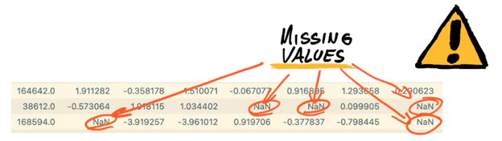

There are multiple ways to address this problem. There are no good or bad decisions, try them out and see how the algorithm performs with each.  

Remove the lines with missing values. If there aren’t very many missing values, a smaller dataset won’t be an issue. 
Impute value. Simulate a value to fill in the missing field. The idea is to use the example (line) but reduce the effect of missing values. Try replacing with the mean/maximum/minimum value of the feature (column.) You can also impute based on K-means, which will predict the value with an eye to the other values (columns.)  
When you’re working with data extracted from outside sources, it’s worth factoring in system failures. These failures take the form of incomplete reporting – taking only partial snapshots of the dataset – and can result in missing values.  
Let's check for missing values:  

```python
t0 = time.time() 

print(pandas_df.columns[pandas_df.isna().any()]) 

pandas_time = time.time()- t0 

 

t1 = time.time() 

print(modin_df.columns[modin_df.isna().any()]) 

modin_time = time.time() - t1 

Index([], dtype='object')  

Index([], dtype='object') 
```

Fortunately, in this example there are no missing values, so you can move on to sub-sampling. 
<a name="subsampling"></a>
### Subsampling

Take a look at the distribution of your data. 

```python
sub_sample_plot=sns.countplot(pandas_df["Class"]) 

sub_sample_plot 
```

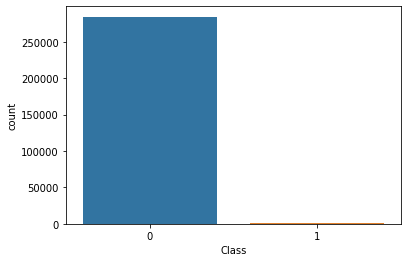

It’s clear that the class (FRAUD or NO FRAUD) is very unbalanced. That means that most cases aren't fraud and just a few are FRAUD.

To train a model with the entire dataset, the model should learn how to detect the majority of cases (NO FRAUD), which is not what we want: We want to detect fraud.

If a model is trained with this data, it would reach high levels of accuracy, but that’s not the outcome you want. (Part three of this tutorial explains how to select a metric based on the criteria you’re seeking.)

Here are some ways to solve this problem: 

1. Obtain more FRAUD examples. Ask the dataset owner for more examples. Usually, however, you need to work with the dataset you have.

2. Increase FRAUD examples: If there are examples of the class you want to detect, use an algorithm to generate a considerable number of examples of the desired class. This solution is used mainly in computer vision scenarios but works for others as well.

3. Use a different dataset where the ratio of FRAUD to NO FRAUD is close to 1:1. 

Now you’re ready to create a new dataset with a useful ratio for generalizing both classes. 

First, create a NEW balanced dataset.  

```python
modin_df_sub = modin_df.sample(frac=1)  #Shuffling the dataframe 

 

modin_df_sub_nf = modin_df_sub.loc[modin_df["Class"] == 0][:492] 

modin_df_sub_f = modin_df_sub.loc[modin_df["Class"]==1] 

 

# Will reuse all fraud points, will random sample out 492 non-fraud points 

 

# New sample Table 

modin_df_sub_distributed = pd.concat([modin_df_sub_nf,modin_df_sub_f]) 

modin_balanced = modin_df_sub_distributed.sample(frac=1, random_state=42) 

```
The resulting balanced dataset makes it easier to train the algorithm. 

```python
sub_sample_plot=sns.countplot(modin_balanced["Class"]) 

sub_sample_plot 
```


Now you have the data necessary to demonstrate a fair representation of FRAUD and NO FRAUD examples. It should also be clear what advantages the Intel® Distribution of Modin provides — with no code changes. 

<a name="section2"></a>

## Section 2 : Data transformation

For this tutorial, you’ll need scikit-learn* ([sklearn](https://scikit-learn.org/stable)) It’s a very useful and robust libraries for machine learning in [Python](https://www.python.org/). It provides a selection of efficient tools for machine learning and statistical modeling including classification, regression, clustering, and dimensionality reduction through a consistent interface in Python. This library, which is largely written in Python, is built on [NumPy](https://numpy.org/), [SciPy](https://scipy.org/) and [Matplotlib](https://matplotlib.org/).  

The Intel® Extension for scikit-learn offers you a way to accelerate existing scikit-learn code. The acceleration is achieved through patching: replacing the stock scikit-learn algorithms with their optimized versions provided by the extension (see the [guide](https://www.intel.com/content/www/us/en/developer/tools/oneapi/scikit-learn.html#gs.8yoqc6) That means you don’t need to learn a new library but still get the benefits of using scikit, optimized.  
The example below will show the benefits.
<a name="split"></a>
### Split Data

A common mistake is to perform all the preprocessing transformations on the data before performing the separation between train/test/valid sub-samples. In a real-word case, the data you’ll have available is the training data while test data will be what you’re going to predict. Making the transformation before splitting means that you’ll be transforming the training data with information present in the test dataset, meaning there will be contaminated data and the results will be biased.  

How can you avoid it? Simple: by splitting the data. There are [multiple ways](https://towardsdatascience.com/how-to-select-a-data-splitting-method-4cf6bc6991da) to do it -- randomly, weighted, among others. Here, you’ll divide it randomly, but with balanced examples of both classes (50/50 if possible.)  It’s good practice to divide in a 80/20 ratio, meaning that 80% of our data will be used to train the model (there’s a validation dataset which could be the 20% of the train data, this is useful when training the model to see how it’s performing), and 20% will be used to verify how the model performs with data the model has never seen before.  

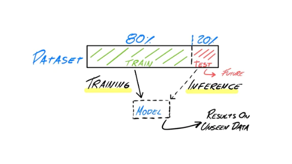

In short, we could use the whole dataset to visualize it, but it needs to be split up as soon as you start working on transformations.
<a name="trans"></a>
### Transformations 
Now you’ll modify the data to make it easier for the algorithm to detect its behavior. These are the most common transformations, and even so they require patience. After training the model you’ll find out if these transformations were useful or not. You can train a model without any transformation, but it’s highly recommended to transform the data first. 

A transformation can be understood as a modification of the data without changing its patterns. For example, if you have a feature called “age” represented in values between 0 and 100, it might be represented in groups such as young (0), adult (1), senior (2.)
<a name="scaling"></a>
### Scaling
It's always a good idea to scale the data to reduce the effect of data represented in value ranges. The model might skew towards those features with bigger numbers, for example if “customer seniority” is represented from 0-20 and the “transaction amount” is between 1,000 and 10,000,000, the model might weight the “transaction amount” more than customer seniority. Which might be true, but you’ll be biased if the model is trained with data in this format. 

```python
X_train.describe()
```


<div>
<table border="1" class="dataframe">
  <thead>
    <tr style="text-align: right;">
      <th></th>
      <th>Time</th>
      <th>V1</th>
      <th>V2</th>
      <th>V3</th>
      <th>V4</th>
      <th>V5</th>
      <th>V6</th>
      <th>V7</th>
      <th>V8</th>
      <th>V9</th>
      <th>...</th>
      <th>V20</th>
      <th>V21</th>
      <th>V22</th>
      <th>V23</th>
      <th>V24</th>
      <th>V25</th>
      <th>V26</th>
      <th>V27</th>
      <th>V28</th>
      <th>Amount</th>
    </tr>
  </thead>
  <tbody>
    <tr>
      <th>count</th>
      <td>787.000000</td>
      <td>787.000000</td>
      <td>787.000000</td>
      <td>787.000000</td>
      <td>787.000000</td>
      <td>787.000000</td>
      <td>787.000000</td>
      <td>787.000000</td>
      <td>787.000000</td>
      <td>787.000000</td>
      <td>...</td>
      <td>787.000000</td>
      <td>787.000000</td>
      <td>787.000000</td>
      <td>787.000000</td>
      <td>787.000000</td>
      <td>787.000000</td>
      <td>787.000000</td>
      <td>787.000000</td>
      <td>787.000000</td>
      <td>787.000000</td>
    </tr>
    <tr>
      <th>mean</th>
      <td>87308.590851</td>
      <td>-2.291426</td>
      <td>1.791328</td>
      <td>-3.356106</td>
      <td>2.292644</td>
      <td>-1.502895</td>
      <td>-0.697463</td>
      <td>-2.688407</td>
      <td>0.243095</td>
      <td>-1.312837</td>
      <td>...</td>
      <td>0.181585</td>
      <td>0.405502</td>
      <td>-0.017708</td>
      <td>-0.002603</td>
      <td>-0.029157</td>
      <td>0.007357</td>
      <td>0.014952</td>
      <td>0.081577</td>
      <td>0.043965</td>
      <td>103.586557</td>
    </tr>
    <tr>
      <th>std</th>
      <td>48151.376393</td>
      <td>5.316830</td>
      <td>3.568666</td>
      <td>5.987156</td>
      <td>3.140819</td>
      <td>4.094094</td>
      <td>1.719691</td>
      <td>5.672757</td>
      <td>4.948775</td>
      <td>2.254574</td>
      <td>...</td>
      <td>0.998783</td>
      <td>2.924874</td>
      <td>1.201339</td>
      <td>1.240150</td>
      <td>0.541629</td>
      <td>0.666629</td>
      <td>0.466151</td>
      <td>0.971632</td>
      <td>0.405105</td>
      <td>220.644740</td>
    </tr>
    <tr>
      <th>min</th>
      <td>260.000000</td>
      <td>-29.876366</td>
      <td>-8.402154</td>
      <td>-30.558697</td>
      <td>-3.722507</td>
      <td>-21.665654</td>
      <td>-6.406267</td>
      <td>-41.506796</td>
      <td>-38.987263</td>
      <td>-13.434066</td>
      <td>...</td>
      <td>-3.493050</td>
      <td>-21.453736</td>
      <td>-8.887017</td>
      <td>-19.254328</td>
      <td>-2.307453</td>
      <td>-4.781606</td>
      <td>-1.152671</td>
      <td>-7.263482</td>
      <td>-1.796363</td>
      <td>0.000000</td>
    </tr>
    <tr>
      <th>25%</th>
      <td>45177.000000</td>
      <td>-2.789009</td>
      <td>-0.179972</td>
      <td>-5.093864</td>
      <td>-0.062235</td>
      <td>-1.741748</td>
      <td>-1.539372</td>
      <td>-2.987206</td>
      <td>-0.200752</td>
      <td>-2.257326</td>
      <td>...</td>
      <td>-0.183045</td>
      <td>-0.179189</td>
      <td>-0.553819</td>
      <td>-0.207802</td>
      <td>-0.373465</td>
      <td>-0.328255</td>
      <td>-0.293797</td>
      <td>-0.053358</td>
      <td>-0.051515</td>
      <td>1.520000</td>
    </tr>
    <tr>
      <th>50%</th>
      <td>79294.000000</td>
      <td>-0.801931</td>
      <td>0.984405</td>
      <td>-1.188498</td>
      <td>1.401166</td>
      <td>-0.497317</td>
      <td>-0.626831</td>
      <td>-0.657817</td>
      <td>0.154563</td>
      <td>-0.765079</td>
      <td>...</td>
      <td>0.014441</td>
      <td>0.148284</td>
      <td>0.016430</td>
      <td>-0.009364</td>
      <td>0.011580</td>
      <td>0.057425</td>
      <td>-0.018519</td>
      <td>0.050750</td>
      <td>0.039347</td>
      <td>20.000000</td>
    </tr>
    <tr>
      <th>75%</th>
      <td>135098.500000</td>
      <td>1.074218</td>
      <td>2.787293</td>
      <td>0.350978</td>
      <td>4.177147</td>
      <td>0.447934</td>
      <td>0.060591</td>
      <td>0.251042</td>
      <td>0.862115</td>
      <td>0.123667</td>
      <td>...</td>
      <td>0.431632</td>
      <td>0.643157</td>
      <td>0.558279</td>
      <td>0.200205</td>
      <td>0.368764</td>
      <td>0.371163</td>
      <td>0.329961</td>
      <td>0.423333</td>
      <td>0.227508</td>
      <td>99.990000</td>
    </tr>
    <tr>
      <th>max</th>
      <td>171914.000000</td>
      <td>2.338892</td>
      <td>21.467203</td>
      <td>3.453140</td>
      <td>12.114672</td>
      <td>11.095089</td>
      <td>6.065901</td>
      <td>5.802537</td>
      <td>19.587773</td>
      <td>3.353525</td>
      <td>...</td>
      <td>10.440718</td>
      <td>27.202839</td>
      <td>8.361985</td>
      <td>5.303607</td>
      <td>1.091435</td>
      <td>2.156042</td>
      <td>2.745261</td>
      <td>3.052358</td>
      <td>1.779364</td>
      <td>2125.870000</td>
    </tr>
  </tbody>
</table>
<p>8 rows x 30 columns</p>
</div>

As you can see from the train data output, most of the features give us the impression that are “scaled” except for “time” and “amount,” which have larger numbers. Avoid using the data as it is now because the model would interpret “time” and “amount” as the two most important features. 

If you plot amount and a feature (V1, orange), you'll notice that amount (blue) appears much lower and not centered at all. This happens because the values of V1 and amount are very different, and it will affect how our model can learn from those features. 
    

```python
X_train['Amount'].plot(kind='kde',xlim=(100,100))
X_train['V1'].plot(kind='kde',xlim=(-100,100))
```
    
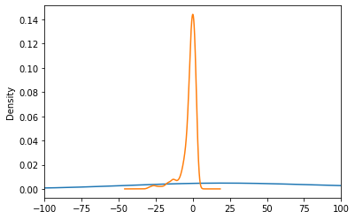
    
Let’s scale the data now. The idea is to keep the same “smaller” distribution, representing the initial data between the same defined range to all features. 

There are multiple tools and options to scale and you can do it manually, but scikit-learn* has an [API](https://scikit-learn.org/stable/modules/classes.html) to help with this task. It will depend on the data we have (here’s a good [guide](https://scikit-learn.org/stable/modules/preprocessing.html) to select useful calculations). 

In our example we’ll scale the data, using the [StandardScale function](https://scikit-learn.org/stable/modules/generated/sklearn.preprocessing.StandardScaler.html) (industry’s go-to algorithm), you can try others as [RobustScaler](http://scikit-learn.org/stable/modules/generated/sklearn.preprocessing.RobustScaler.html). StandardScaler means that each feature will have a mean of 0, and each value is divided by the standard deviation. Your goal is to try to center the distribution of the data to reduce the effect of variables that are in a different scale. Note that if our data has outliers (as explained below), we should try to reduce the effect by using other scalers like RobustScaler

```python
standard = StandardScaler()
data_st = standard.fit_transform(X_train)

# convert the array back to a dataframe
dataset_std = DataFrame(data_st, columns=col_names)
dataset_std.describe()
```


<div>

<table border="1" class="dataframe">
  <thead>
    <tr style="text-align: right;">
      <th></th>
      <th>Time</th>
      <th>V1</th>
      <th>V2</th>
      <th>V3</th>
      <th>V4</th>
      <th>V5</th>
      <th>V6</th>
      <th>V7</th>
      <th>V8</th>
      <th>V9</th>
      <th>...</th>
      <th>V20</th>
      <th>V21</th>
      <th>V22</th>
      <th>V23</th>
      <th>V24</th>
      <th>V25</th>
      <th>V26</th>
      <th>V27</th>
      <th>V28</th>
      <th>Amount</th>
    </tr>
  </thead>
  <tbody>
    <tr>
      <th>count</th>
      <td>7.870000e+02</td>
      <td>7.870000e+02</td>
      <td>7.870000e+02</td>
      <td>7.870000e+02</td>
      <td>7.870000e+02</td>
      <td>7.870000e+02</td>
      <td>7.870000e+02</td>
      <td>7.870000e+02</td>
      <td>7.870000e+02</td>
      <td>7.870000e+02</td>
      <td>...</td>
      <td>7.870000e+02</td>
      <td>787.000000</td>
      <td>7.870000e+02</td>
      <td>7.870000e+02</td>
      <td>7.870000e+02</td>
      <td>7.870000e+02</td>
      <td>7.870000e+02</td>
      <td>7.870000e+02</td>
      <td>7.870000e+02</td>
      <td>7.870000e+02</td>
    </tr>
    <tr>
      <th>mean</th>
      <td>-1.083420e-16</td>
      <td>-4.965674e-17</td>
      <td>4.062824e-16</td>
      <td>-7.583938e-16</td>
      <td>1.670272e-16</td>
      <td>-1.128562e-16</td>
      <td>-4.604534e-16</td>
      <td>-2.708549e-16</td>
      <td>3.159974e-17</td>
      <td>4.694819e-16</td>
      <td>...</td>
      <td>1.512273e-16</td>
      <td>0.000000</td>
      <td>-4.514249e-18</td>
      <td>1.579987e-17</td>
      <td>-1.128562e-16</td>
      <td>-3.159974e-17</td>
      <td>-5.417098e-17</td>
      <td>7.674223e-17</td>
      <td>-1.354275e-17</td>
      <td>3.114832e-16</td>
    </tr>
    <tr>
      <th>std</th>
      <td>1.000636e+00</td>
      <td>1.000636e+00</td>
      <td>1.000636e+00</td>
      <td>1.000636e+00</td>
      <td>1.000636e+00</td>
      <td>1.000636e+00</td>
      <td>1.000636e+00</td>
      <td>1.000636e+00</td>
      <td>1.000636e+00</td>
      <td>1.000636e+00</td>
      <td>...</td>
      <td>1.000636e+00</td>
      <td>1.000636</td>
      <td>1.000636e+00</td>
      <td>1.000636e+00</td>
      <td>1.000636e+00</td>
      <td>1.000636e+00</td>
      <td>1.000636e+00</td>
      <td>1.000636e+00</td>
      <td>1.000636e+00</td>
      <td>1.000636e+00</td>
    </tr>
    <tr>
      <th>min</th>
      <td>-1.808961e+00</td>
      <td>-5.191530e+00</td>
      <td>-2.858201e+00</td>
      <td>-4.546381e+00</td>
      <td>-1.916371e+00</td>
      <td>-4.927972e+00</td>
      <td>-3.321780e+00</td>
      <td>-6.847301e+00</td>
      <td>-7.932328e+00</td>
      <td>-5.379703e+00</td>
      <td>...</td>
      <td>-3.681452e+00</td>
      <td>-7.478317</td>
      <td>-7.387548e+00</td>
      <td>-1.553358e+01</td>
      <td>-4.209053e+00</td>
      <td>-7.188414e+00</td>
      <td>-2.506412e+00</td>
      <td>-7.564318e+00</td>
      <td>-4.545735e+00</td>
      <td>-4.697707e-01</td>
    </tr>
    <tr>
      <th>25%</th>
      <td>-8.755385e-01</td>
      <td>-9.364597e-02</td>
      <td>-5.527424e-01</td>
      <td>-2.904322e-01</td>
      <td>-7.502424e-01</td>
      <td>-5.837804e-02</td>
      <td>-4.898809e-01</td>
      <td>-5.270600e-02</td>
      <td>-8.974526e-02</td>
      <td>-4.191878e-01</td>
      <td>...</td>
      <td>-3.653061e-01</td>
      <td>-0.200030</td>
      <td>-4.465456e-01</td>
      <td>-1.655682e-01</td>
      <td>-6.360933e-01</td>
      <td>-5.037666e-01</td>
      <td>-6.627597e-01</td>
      <td>-1.389628e-01</td>
      <td>-2.358435e-01</td>
      <td>-4.628774e-01</td>
    </tr>
    <tr>
      <th>50%</th>
      <td>-1.665516e-01</td>
      <td>2.803253e-01</td>
      <td>-2.262569e-01</td>
      <td>3.622733e-01</td>
      <td>-2.840166e-01</td>
      <td>2.457727e-01</td>
      <td>4.109883e-02</td>
      <td>3.581824e-01</td>
      <td>-1.790102e-02</td>
      <td>2.431085e-01</td>
      <td>...</td>
      <td>-1.674546e-01</td>
      <td>-0.087997</td>
      <td>2.843420e-02</td>
      <td>-5.455208e-03</td>
      <td>7.526083e-02</td>
      <td>7.515340e-02</td>
      <td>-7.184891e-02</td>
      <td>-3.174745e-02</td>
      <td>-1.140743e-02</td>
      <td>-3.790696e-01</td>
    </tr>
    <tr>
      <th>75%</th>
      <td>9.931243e-01</td>
      <td>6.334197e-01</td>
      <td>2.792637e-01</td>
      <td>6.195667e-01</td>
      <td>6.003854e-01</td>
      <td>4.768012e-01</td>
      <td>4.410889e-01</td>
      <td>5.184990e-01</td>
      <td>1.251651e-01</td>
      <td>6.375565e-01</td>
      <td>...</td>
      <td>2.505104e-01</td>
      <td>0.081305</td>
      <td>4.797588e-01</td>
      <td>1.636388e-01</td>
      <td>7.351425e-01</td>
      <td>5.460856e-01</td>
      <td>6.761941e-01</td>
      <td>3.519574e-01</td>
      <td>4.533634e-01</td>
      <td>-1.631058e-02</td>
    </tr>
    <tr>
      <th>max</th>
      <td>1.758189e+00</td>
      <td>8.714332e-01</td>
      <td>5.517016e+00</td>
      <td>1.138032e+00</td>
      <td>3.129207e+00</td>
      <td>3.079068e+00</td>
      <td>3.935397e+00</td>
      <td>1.497745e+00</td>
      <td>3.911469e+00</td>
      <td>2.071048e+00</td>
      <td>...</td>
      <td>1.027816e+01</td>
      <td>9.167702</td>
      <td>6.979729e+00</td>
      <td>4.281404e+00</td>
      <td>2.070246e+00</td>
      <td>3.225257e+00</td>
      <td>5.860858e+00</td>
      <td>3.059462e+00</td>
      <td>4.286552e+00</td>
      <td>9.171166e+00</td>
    </tr>
  </tbody>
</table>
<p>8 rows × 30 columns</p>
</div>

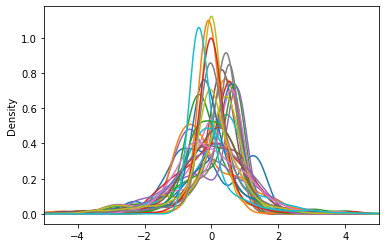
<a name="outliers"></a>
### Outliers
Now that the data is almost ready to train our model, there’s another important thing to check. It’s well organized now but we can still find values in the features (columns) that can affect the model as it might be the presence of an outlier. 

An outlier is a value whose distance from other values is abnormal (unusual.) For example, if most customer transactions (the mean) cluster around a value, let’s say $100. An outlier is a transaction of $1 million and using this value to train our model will have a negative effect because it misleads the training process resulting in longer training times, less accurate models, and ultimately poorer results. 

Therefore, you need to know how to handle these values, whether they are mild or extreme. Outliers should be carefully investigated. They often contain valuable information about the process under investigation or the data gathering and recording process -- an error might add extra numbers and make the value appear as an outlier. Before considering removal, try to understand why they appeared and whether similar values are likely to continue to appear. Of course, outliers are often bad data points. 

In this example, you’ll eliminate those values that are three times away from [interquartile range](https://en.wikipedia.org/wiki/Interquartile_range) (the difference between 25% and 75% of the data), which are called extreme outliers (1.5 of distance are regular outliers), since you are not able to understand the data (it’s anonymized, and we don’t know how the data was extracted.) To identify them, you can use two graphic techniques, [box plots](https://en.wikipedia.org/wiki/Box_plot) and [scatter plots](https://en.wikipedia.org/wiki/Scatter_plot).  

Here’s an example, keeping in mind that in real-case scenario with more information about the features you could investigate further.

```python
# Example to plot the outliers for 1 feature. You'll be using V5 

fig = plt.figure(figsize =(10,5))
 
# Creating plot
plt.boxplot(X_train['V1'].loc[X_train['Class'] == 1],whis=3)    # "whis" is to define the range of IQR
 
# show plot
plt.show()
```
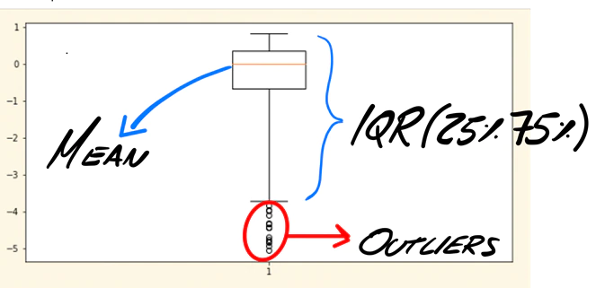

```python
## # Example to plot the outliers for 1 feature

# # V1
v1_fraud = X_train['V1'].loc[X_train['Class'] == 1].values
q25, q75 = np.percentile(v1_fraud, 25), np.percentile(v1_fraud, 75)
print('Quartile 25: {} | Quartile 75: {}'.format(q25, q75))
v1_iqr = q75 - q25
print('iqr: {}'.format(v1_iqr))

v1_cut_off = v1_iqr * 3
v1_lower, v1_upper = q25 - v1_cut_off, q75 + v1_cut_off
print('Cut Off: {}'.format(v1_cut_off))
print('V5 Lower: {}'.format(v1_lower))
print('V5 Upper: {}'.format(v1_upper))

outliers = [x for x in v1_fraud if x < v1_lower or x > v1_upper]

print('Feature V5 Outliers for Fraud Cases: {}'.format(len(outliers)))
print('V5 outliers:{}'.format(outliers))
```

    Quartile 25: -0.6893563175489766 | Quartile 75: 0.35258934145246884
    iqr: 1.0419456590014455
    Cut Off: 3.1258369770043366
    V5 Lower: -3.815193294553313
    V5 Upper: 3.4784263184568056
    Feature V5 Outliers for Fraud Cases: 13
    V5 outliers:[-4.4292409026773525, -4.54813961123235, -4.082717450164329, -5.0642982754017325, -5.191529500732111, -4.0694218066414125, -4.886395884145655, -4.677233439377554, -4.451157410726059, -4.54813961123235, -4.9370625194319615, -4.196673160286453, -4.54813961123235]

Now you can remove those outliers. Remember to do this process only once, because each time you do it you’ll uncover new outliers and reduce the dataset.  

Next, take a look at those values. You’ll need to iterate through all the features to remove  extreme outliers in each one. 

```python
# Let's remove the outliers
for feature in X_train.columns.difference(['Class']):      # Loop into each feature except class
    
    feature_fraud = X_train[feature].loc[X_train['Class'] == 1].values
    q25, q75 = np.percentile(feature_fraud, 25), np.percentile(feature_fraud, 75)   
    feature_iqr = q75 - q25
    
    feature_cut_off = feature_iqr * 3
    feature_lower, feature_upper = q25 - feature_cut_off, q75 + feature_cut_off
    
    outliers = [x for x in feature_fraud if x < feature_lower or x > feature_upper]

    X_train = X_train.drop(X_train[(X_train[feature] > feature_upper) | (X_train[feature] < feature_lower)].index)

print('Number of Instances after outliers removal: {}'.format(len(X_train)))
```

    Number of Instances after outliers removal: 645
    
As you can see, our dataset is reduced but there’s still enough to train your model. This is not a 50/50 ratio anymore. You can divide again to get 50/50 if you want. However, 57/42 is still a good ratio between FRAUD and NO FRAUD cases. 
```python
print('No Frauds', round(X_train['Class'].value_counts()[0]/len(X_train) * 100,2), '% of the dataset')
print('Frauds', round(X_train['Class'].value_counts()[1]/len(X_train) * 100,2), '% of the dataset')
```
    No Frauds 57.98 % of the dataset
    Frauds 42.02 % of the dataset
    
<a name="fe"></a>
### Feature engineering 
 
 Lastly, there’s another important modification to make to your dataset. [Feature engineering](https://en.wikipedia.org/wiki/Feature_engineering) (FE) or means adding features that are not present and to help the algorithm detect patterns in data. Data scientists [call it](https://www.worldcat.org/title/1149291643) an art because you need to figure out which feature can be added to help and it involves deep understanding of the data. It’s a process of trial and error; don’t worry if that new feature doesn’t work when you test the results.  Auto machine learning ([AutoML](https://en.wikipedia.org/wiki/Automated_machine_learning)) [tools](https://github.com/epistasislab/tpot) can help. They automatically test parameters so you can find “optimal” feature combinations that can also be used during training.  

For example, if you know the description of each feature, suppose there are two features called “amount” and “age.” You could create a new feature called “amount spent by age,” then create a function that splits age ranges and hashes them based on the amount spent. In some cases, it can also just be a categorical value. Here, the data is anonymized so adding features is tricky, but it’s important to be aware of FE. 

In this part, we highlighted the most important preprocessing techniques to use on a tabular data problem such as our fraud detection case.  

Now your data is ready to be used to train a model (Part three.) The preprocessing and training stages are an [iterative process](https://en.wikipedia.org/wiki/Iterative_method) in which transformations performed may or may not help teach the algorithm. Remember that your goal is to have an algorithm that can work well on unseen data in the very last stage. You might have to repeat or modify this process several times to get there. 

<a name="section3"></a>

## Section 3 : Training

For this final part of the tutorial, you’ll need scikit-learn* (sklearn.) It’s the one of the most useful and robust libraries for machine learning in Python. It provides a selection of efficient tools for machine learning and statistical modeling including classification, regression, clustering, and dimensionality reduction through a consistent interface in Python. This library, largely written in Python, is built on NumPy, SciPy and Matplotlib. 

The Intel® Extension for scikit-learn offers you a way to accelerate existing scikit-learn code. The acceleration is achieved through patching: replacing the stock scikit-learn algorithms with their optimized versions provided by the extension (see the guide). That means you don’t need to learn a new library but still get the benefits of using sklearn, optimized.  
The example below will show the benefits.

Which algorithm should you use? The one that best predicts your future data. That sounds simple but selecting the most advanced algorithm doesn’t mean that it will be useful on our data. It’ll be the one that gives you the best results (in test) over the metric we choose. Don’t expect a 100% accuracy because that's not a good sign: Decide in advance what would be an acceptable value (70%, 80%, 90%). Remember to consider how long it takes the algorithm to process the results. 

<a name="algo"></a>
### Algorithms

Now you’ll explore two families of algorithms: logistic regression and decision trees. Before diving in, you’ll need a basic understanding of how metrics work and how they can help us to understand the behavior of the model.

#### Accuracy / Precision / Recall / F1 score

Each metric has advantages and disadvantages, and each of them will give you specific information on the strengths and weaknesses of your model. 

Even if the words “accuracy” and "precision” have similar meanings, for artificial intelligence they are two different concepts. When you need to know the overall performance of the model, pay attention to accuracy only. This is defined as simply the fraction of correct classifications (correct classifications/all classifications). It won’t help in cases like this one, where it’s important to get a model that can detect fraud cases because it’s a metric that works to detect all correct predictions regardless of whether they are fraud or not fraud. In other words, accuracy can answer this question: Of all the classified examples (fraud and no fraud) what percentage did the model get right?  

Moreover, in AI the term precision considers both true positives (TP) and false positives (FP) (TP/(TP+FP)). This will give you a ratio between hits and errors for each class for positive predictions. In other words, a precise answer to this question: Of the examples the model flags as fraud, what percentage were actually fraud?  

Finally, the term “recall” differs to precision because it considers false negatives (FN) (TP/(TP+FN). It gives you more information because it also considers those examples that the model classified incorrectly as no fraud when they are fraud.   

In other words, recall answers this question: Of the examples that were actually fraud, what percentage was predicted as fraud by the model? 

There’s one more metric to keep in mind called the F1-Score, an average between precision and recall. You’ll get a harmonic mean, which can be useful because it represents both precision and recall represented in just one metric.


#### Confusion matrix
This a table with the combinations of predicted and real values. It shows how many examples are TP, NP, FN, TN. 

Now you’re ready to build your models. Depending on which algorithm and framework you're using, there are different ways to train the model. Intel optimizations can help speed them up, too. There are several approaches to consider including regression, decision trees, neural networks and support vector machines among others.  

Here we’ll test regressions and decision trees and [this GitHub notebook](https://github.com/ezelanza/tutorials/blob/main/Optimized%20Fraud%20Detection/Main.ipynb) will show how Intel optimizations can help. 


### Model 1: Logistic Regression

Regression is a statistical method by which one variable is explained or understood on the basis of one or more variables. The variable being explained is called the dependent, or response, variable; the other variables used to explain or predict the response are called independent variables (Hilbe, 2017) 

Regression is a type of supervised learning. Making the model fit can result in slow training but the prediction is fast. It can’t help in scenarios where the relationship between them is not easy to predict (complex relationships). 

To understand logistic regression, you need to understand a linear regression first. 

Let’s say you would like to predict the number of lines coded based on time coding (1 dependant variable) Image 2. A linear regression will find a function (blue dotted line) that can return a value (lines) when you give your input variable (hours coding), there is a multivariable regression when you have multiple dependant variables, but the concept is still the same. Linear Regression (dotted line) then will return a continuous value (number). It won’t be helpful in this Fraud detection case where you are looking to a classification of “fraud” or “not fraud”.
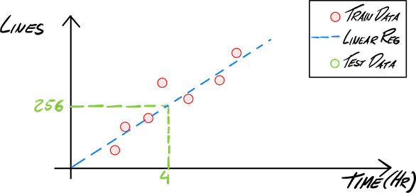

Then, you’ll use Logistic Regression (image 3). It will give you “true” and “false” values (fraud or not fraud). Instead of fitting a line, logistic regression fits an “S” shape which corresponds to a probability value of being “true,” in other words a value between 0 and 1 where the model will consider “true” if it’s higher than 0.5.

To classify, start from an input value marked in green (X-axis), and a line is drawn up to the intersection with the blue line (log reg), with the value in Y-axis as the result for that value. Because the match here is less than 0.5 (0.41) it will be labeled as "fraud." You can calculate all the test values using the same procedure. This is done automatically when you ask the model to "label" your cases.

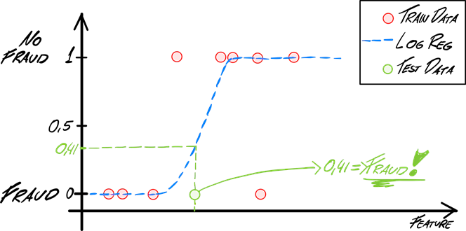

#### Train
You’ll start training the model, using sklearn API “[fit](https://scikit-learn.org/stable/developers/develop.html)”. It will train the model with X (train data without labels) and y (labels of train data). Pretty straightforward.

```python
clf = LogisticRegression(random_state=0).fit(X, y)
```

#### Performance in TRAIN
Once the model is trained, you can take a better look at its performance and start predicting the labels for the “train” dataset. Note: sklearn will provide you with the label (1 or 0), you can use predict.proba  to see the probabilities.

```python
y_pred= clf.predict(X)     # It will give the  

target_names = ["FRAUD","NO FRAUD"] 

 
print(classification_report(y, y_pred,target_names=target_names)) 

```
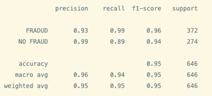
As you can see, it’s at 95% percent accuracy. It means that the model can correctly identify most of the examples. Since our goal is to have a model capable of generalizing on unseen data, you can imagine that high levels of accuracy in training is related to good results, right? 

However, that's not the case. High levels of accuracy in training means that the model has a perfect understanding of the data provided (train). Test cases are not necessarily equal to train examples -- the accuracy there could drop from 95% in training to ~50% in test.  

For example, if you’re building a model to detect cows and you get the 100% accuracy in train, when you move to test it won’t be able to detect a slightly different cow, your model is not able to generalize. Known as "overfitting,” there are multiple ways to avoid it. Random samples, equally distributed datasets, cross-validation, early stopping or regularization between other techniques are useful. 

Note: It’s a good thing when you get high levels of accuracy in "test" (inference)!

```python 
## Confusion matrix 

from sklearn.metrics import plot_confusion_matrix 

 

#y_pred = clf.predict(X) 

plot_confusion_matrix(clf,X, y) 
```
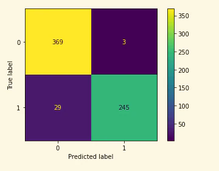

#### Performance in TEST
This next step is known as inference.  Now that you’ve trained the algorithm trained, you need to verify the performance on unseen data. You’ll test with the same metrics you did for training, but it's time to start thinking about how this model will perform in your solution. For example: Will the implementation consist of thousands of inferences at the same time? In that case, you’ll have pay attention to the time the algorithm takes to give you the result (fraud vs no fraud), you will probably choose the algorithm that gives you the result faster, normally combined with analysis of the hardware and software optimizations available.

```python 
test_pred=clf.predict(test)  

 
target_names = ["FRAUD","NO FRAUD"] 

 
print(classification_report(y_test, test_pred,target_names=target_names))
```
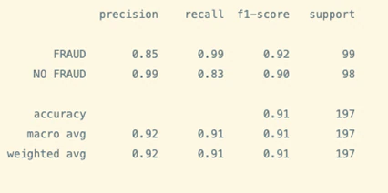

```python
plot_confusion_matrix(clf,test, y_test)
```
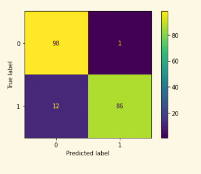

As you can see there’s a drop in metrics results when making the inference. It’s still a good predictor but it makes mistakes, and you should evaluate how important are those mistakes are overall. As a guideline, a model with 85% precision on fraud cases is not bad at all.
### Model 2 : Decision Trees

A decision tree is a type of supervised learning. A decision tree can help you decide a question like: “Is this a good day to code?” The inputs could be factors such as time of day, external noise, and hours coding. The algorithm will find in the training data the best split to classify if it’s a good day to code or it doesn’t. The result might look like the following:
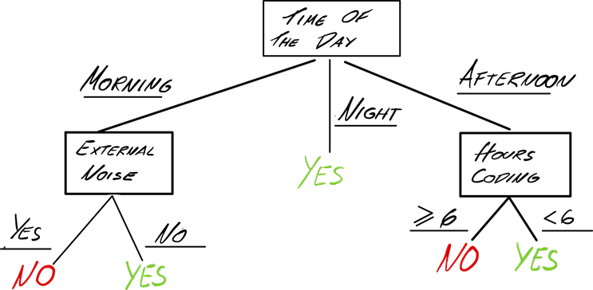
The concept was first introduced by Leo Breiman in 1984 (Breiman, 2017). Here you'll use [Random Forests](https://www.stat.berkeley.edu/~breiman/RandomForests) which is a decision tree-based algorithm that builds several trees while training and selects the best to use. [XGboost](https://xgboost.ai/) or [LightGBM](https://lightgbm.readthedocs.io/en/v3.3.2), and many others share the same concept behind with different approaches and techniques to build the decision trees.

Decision trees can give a very intuitive explanation about how the decisions were made. Keep in mind, though, that it might be inadequate when you’re looking to predict continuous values.
#### TRAIN
There are multiple parameters you can use to train your [Random Forest algorithm](https://scikit-learn.org/stable/modules/generated/sklearn.ensemble.RandomForestClassifier.html). Here we’re using a “classifier” to fine tune it. In this case, you’ll keep it as simple as possible to get decent results. Start with a different max_depth value. You’re defining the depth of the decisions tree (longer can be better but could overfit the model.) Here you’ll use six, but you can try with different values to see how performance changes.
```python 
clf = RandomForestClassifier(max_depth=6, random_state=0) 

clf.fit(X, y)
```

#### Performance in TRAIN
Check the performance in train. The results seem slightly better than logistic regression.
```python
y_pred_RF= clf.predict(X) 

target_names = ["FRADUD","NO FRAUD"] 

 
print(classification_report(y, y_pred_RF,target_names=target_names)) 
```


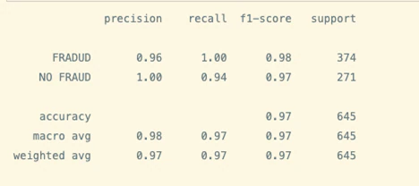

#### Performance in test (inference):

```python
test_pred_RF=clf.predict(test)  

target_names = ["FRAUD","NO FRAUD"] 

print(classification_report(y_test, test_pred_RF,target_names=target_names)) 
```


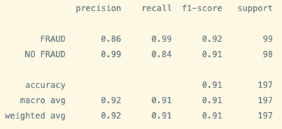
After training two simple models you can expect decent performance (in test) on both.


### Conclusion
In this tutorial, you’ve trained a model to detect possible fraudulent transactions with a few different models. The tutorial covered the main concepts around how to train a model that can be used to detect fraud, you’ve prepared/transformed the data and you’ve selected some algorithms to train it.  
With these results, you can now decide which model to use based on metrics, keeping in mind that execution time is an important topic when implementing the algorithm. Your model is almost ready to implement in your application. The next step is to optimize container packing (more on that [here](https://www.intel.com/content/www/us/en/developer/tools/oneapi/application-catalog/full-catalog/ai-optimization-tool-for-container-packing.html), then integrate it into your solution to take advantage of the insights the model will give you.  

The model you trained in this tutorial can potentially save your company time and money by proactively spotting transaction fraud. A recent Gartner [report](https://www.gartner.com/en/newsroom/press-releases/2022-05-24-gartner-identifies-three-technology-trends-gaining-tr) notes the uptick of banks using AI in growth areas such as fraud detection, trading prediction and risk factor modeling.  

### References
Breiman, L. (2017). Classification and regression trees. Routledge. 

Hilbe, J. M. (2017). Logistic Regression Models. Taylor & Francis Ltd. 
