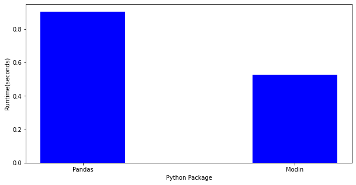

# Use case -  Fraud detection with Intel® Optimizitations

This tutorial, will provide a use case where a credit card company might benefit from machine learning techniques to predict fraudulent transactions. 

## Part 1 - Preprocessing and initial data analysis

In this part, you’ll prepare and preprocess data for an accurate representation of fraud and no-fraud examples using the Intel® Distribution of Modin* You’ll also use an anonymized dataset extracted from Kaggle (https://www.kaggle.com/datasets/mlg-ulb/creditcardfraud) 

The Intel® Distribution of Modin will help you execute operations faster using the same API as pandas*. The library is fully compatible with the pandas API. OmniSci* powers the backend and provides accelerated analytics on Intel® platforms. (Here are installation instructions.)
Note: Modin does not currently support distributed execution for all methods from the pandas API. The remaining unimplemented methods are executed in a mode called “default to pandas.” This allows users to continue using Modin even though their workloads contain functions not yet implemented in Modin.


### Import Modules and functions


```python
### Import modules and define functions

import os
import time
import numpy as np
import matplotlib.pyplot as plt
import seaborn as sns
```


```python
# Import regular pandas
import pandas
```


```python
# Import Modin 

#USE ONLY ONE OF THESE:

#os.environ["MODIN_ENGINE"] = "ray"  # Modin will use Ray
os.environ["MODIN_ENGINE"] = "dask"  # Modin will use Dask

import modin.pandas as pd
```


```python
def plotter(outputdict):
    fig = plt.figure(figsize = (10, 5)) 
    plt.bar(outputdict.keys(),outputdict.values(),color='blue',width=0.4)
    plt.xlabel("Python Package")
    plt.ylabel("Runtime(seconds)")
    plt.show()
# ****** Do not change the code in this cell! It verifies that the notebook is being run correctly! ******

def verify_and_print_times(pandas_time, modin_time):
    if modin_time < pandas_time:
        print(f"Modin was {pandas_time / modin_time:.2f}X faster than stock pandas!")
        return
    print(
        f"Oops, stock pandas appears to be {modin_time / pandas_time:.2f}X faster than Modin in this case. "
        "This is unlikely but could happen sometimes on certain machines/environments/datasets. "
        "One of the most probable reasons is the excessive amount of partitions being assigned to a single worker. "
        "You may visit Modin's optimization guide in order to learn more about such cases and how to fix them: "
        "\nhttps://modin.readthedocs.io/en/latest/usage_guide/optimization_notes/index.html\n\n"
        "But first, verify that you're using the latest Modin version, also, try to use different executions, "
        "for basic usage we recommend non-experimental 'PandasOnRay'.\n"
        "Current configuration is:"
    )
    try:
        from modin.utils import get_current_execution

        execution = get_current_execution()
    except ImportError:
        # for modin version < 0.12.0
        try:
            from modin.utils import get_current_backend

            execution = get_current_backend()
        except ImportError:
            # for modin versions < 0.8.1
            execution = (
                "Can't deduce the current execution, your Modin version is too old!"
            )
    print(f"\tExecution: {execution}")
    try:
        import modin.config as cfg

        print(
            f"\tIs experimental: {cfg.IsExperimental.get()}\n"
            f"\tNumber of CPUs to utilize by Modin (check that Modin uses all CPUs on your machine): {cfg.CpuCount.get()}\n"
            f"\tIs in debug mode (debug mode may perform slower): {cfg.IsDebug.get()}"
        )
    except (ImportError, AttributeError):
        # for modin versions < 0.8.2
        print("\tCan't deduce Modin configuration, your Modin version is too old!")
    import modin

    print(f"\tModin version: {modin.__version__}")
```

###  Preprocessing and analysis of data

The first step is to pre-process the data. After you download and extract the data, you’ll have it in spreadsheet format. That means you’ll work with tabular data where each row is a transaction (example) and each column is a feature (transaction amount, credit limit, age.) In this tutorial you won’t know which represents each feature, since the data has been anonymized for privacy purposes. This example uses supervised learning, meaning the algorithm) is trained on a pre-defined set of examples. The examples are labeled with one column called LABEL (FRAUD or NOT FRAUD)

In a real-world case, the data could come from multiple sources (such as SQL, Oracle Database* or Apache Spark*.) The idea is to have one spreadsheet file to put in the algorithm to train it. To do that, you need to concatenate or join multiple files to get one main dataset. Joining multiple sources can result in a main dataset with thousands of lines and hundreds of columns. Working with such a large file can strain on your computer/server for memory and processing, so it’s important to use optimized frameworks to speed up this task. 

First, load the dataset. You’ll use both regular pandas and optimized Modin-Pandas (pd). By using both, you’ll see the difference when your device uses all of its cores instead of using just one core. This will verify how Modin helps.


```python
# Locally unzip document donwloaded from Kaggle
!unzip Dataset.csv.zip
```

    Archive:  Dataset.csv.zip
      inflating: Dataset.csv             


```python
t0 = time.time()
pandas_df = pandas.read_csv("Dataset.csv")
pandas_time = time.time()- t0

t1 = time.time()
modin_df = pd.read_csv("Dataset.csv")
modin_time = time.time() - t1

print("Pandas Time(seconds):",pandas_time,"\nModin Time(seconds):",modin_time)
verify_and_print_times(pandas_time, modin_time)
outputDict={"Pandas":pandas_time,"Modin":modin_time}
plotter(outputDict)
```

    Pandas Time(seconds): 0.904883861541748 
    Modin Time(seconds): 0.5271012783050537
    Modin was 1.72X faster than stock pandas!


    

    


As you can see each feature starts with V. We could learn from the data in a real case scenario where we know wha each feature means. 


```python
modin_df.head()
```


<div>
<style scoped>
    .dataframe tbody tr th:only-of-type {
        vertical-align: middle;
    }

    .dataframe tbody tr th {
        vertical-align: top;
    }

    .dataframe thead th {
        text-align: right;
    }
</style>
<table border="1" class="dataframe">
  <thead>
    <tr style="text-align: right;">
      <th></th>
      <th>Time</th>
      <th>V1</th>
      <th>V2</th>
      <th>V3</th>
      <th>V4</th>
      <th>V5</th>
      <th>V6</th>
      <th>V7</th>
      <th>V8</th>
      <th>V9</th>
      <th>...</th>
      <th>V21</th>
      <th>V22</th>
      <th>V23</th>
      <th>V24</th>
      <th>V25</th>
      <th>V26</th>
      <th>V27</th>
      <th>V28</th>
      <th>Amount</th>
      <th>Class</th>
    </tr>
  </thead>
  <tbody>
    <tr>
      <th>0</th>
      <td>0</td>
      <td>-1.359807</td>
      <td>-0.072781</td>
      <td>2.536347</td>
      <td>1.378155</td>
      <td>-0.338321</td>
      <td>0.462388</td>
      <td>0.239599</td>
      <td>0.098698</td>
      <td>0.363787</td>
      <td>...</td>
      <td>-0.018307</td>
      <td>0.277838</td>
      <td>-0.110474</td>
      <td>0.066928</td>
      <td>0.128539</td>
      <td>-0.189115</td>
      <td>0.133558</td>
      <td>-0.021053</td>
      <td>149.62</td>
      <td>0</td>
    </tr>
    <tr>
      <th>1</th>
      <td>0</td>
      <td>1.191857</td>
      <td>0.266151</td>
      <td>0.166480</td>
      <td>0.448154</td>
      <td>0.060018</td>
      <td>-0.082361</td>
      <td>-0.078803</td>
      <td>0.085102</td>
      <td>-0.255425</td>
      <td>...</td>
      <td>-0.225775</td>
      <td>-0.638672</td>
      <td>0.101288</td>
      <td>-0.339846</td>
      <td>0.167170</td>
      <td>0.125895</td>
      <td>-0.008983</td>
      <td>0.014724</td>
      <td>2.69</td>
      <td>0</td>
    </tr>
    <tr>
      <th>2</th>
      <td>1</td>
      <td>-1.358354</td>
      <td>-1.340163</td>
      <td>1.773209</td>
      <td>0.379780</td>
      <td>-0.503198</td>
      <td>1.800499</td>
      <td>0.791461</td>
      <td>0.247676</td>
      <td>-1.514654</td>
      <td>...</td>
      <td>0.247998</td>
      <td>0.771679</td>
      <td>0.909412</td>
      <td>-0.689281</td>
      <td>-0.327642</td>
      <td>-0.139097</td>
      <td>-0.055353</td>
      <td>-0.059752</td>
      <td>378.66</td>
      <td>0</td>
    </tr>
    <tr>
      <th>3</th>
      <td>1</td>
      <td>-0.966272</td>
      <td>-0.185226</td>
      <td>1.792993</td>
      <td>-0.863291</td>
      <td>-0.010309</td>
      <td>1.247203</td>
      <td>0.237609</td>
      <td>0.377436</td>
      <td>-1.387024</td>
      <td>...</td>
      <td>-0.108300</td>
      <td>0.005274</td>
      <td>-0.190321</td>
      <td>-1.175575</td>
      <td>0.647376</td>
      <td>-0.221929</td>
      <td>0.062723</td>
      <td>0.061458</td>
      <td>123.50</td>
      <td>0</td>
    </tr>
    <tr>
      <th>4</th>
      <td>2</td>
      <td>-1.158233</td>
      <td>0.877737</td>
      <td>1.548718</td>
      <td>0.403034</td>
      <td>-0.407193</td>
      <td>0.095921</td>
      <td>0.592941</td>
      <td>-0.270533</td>
      <td>0.817739</td>
      <td>...</td>
      <td>-0.009431</td>
      <td>0.798278</td>
      <td>-0.137458</td>
      <td>0.141267</td>
      <td>-0.206010</td>
      <td>0.502292</td>
      <td>0.219422</td>
      <td>0.215153</td>
      <td>69.99</td>
      <td>0</td>
    </tr>
  </tbody>
</table>
<p>5 rows x 31 columns</p>
</div>


Now that the dataset is loaded on your memory, take a closer look. 

#### Dealing with Missing values

One of the first steps in data analysis is to check for missing values, because most algorithms can’t handle missing data. This verification is a useful shorthand to see if the data is accurate. It’s important to know how large the problem is to determine how to handle it. For example, 80% missing values is evidence of a bad dataset, but not a problem when that number is close to 5%. 
There are multiple ways to address the problem. There are no good or bad decisions, try them out and see how the algorithm performs with each.


•	Remove the lines with missing values. If there aren’t very many missing values, a smaller dataset won’t be a problem.


•	Impute value. Simulate a value to fill in the missing field. The idea is to use the example (line) but reduce the effect of missing values. Try replacing with the mean/maximum/minimum value of the feature (column.) You can also impute based on K-means, which will predict the value with an eye to the other values (columns.) 

When you’re working with data extracted from outside sources, it’s worth factoring in system failures. These failures take the form of incomplete reporting – taking only partial snapshots of the dataset – and can result in missing values. 
Let's check for missing values: 


```python
t0 = time.time()
print(pandas_df.columns[pandas_df.isna().any()])
pandas_time = time.time()- t0

t1 = time.time()
print(modin_df.columns[modin_df.isna().any()])
modin_time = time.time() - t1

print("Pandas Time(seconds):",pandas_time,"\nModin Time(seconds):",modin_time)
verify_and_print_times(pandas_time, modin_time)
outputDict={"Pandas":pandas_time,"Modin":modin_time}
```

    Index([], dtype='object')
    Index([], dtype='object')
    Pandas Time(seconds): 0.02335381507873535 
    Modin Time(seconds): 0.23135614395141602
    Oops, stock pandas appears to be 9.91X faster than Modin in this case. This is unlikely but could happen sometimes on certain machines/environments/datasets. One of the most probable reasons is the excessive amount of partitions being assigned to a single worker. You may visit Modin's optimization guide in order to learn more about such cases and how to fix them: 
    https://modin.readthedocs.io/en/latest/usage_guide/optimization_notes/index.html
    
    But first, verify that you're using the latest Modin version, also, try to use different executions, for basic usage we recommend non-experimental 'PandasOnRay'.
    Current configuration is:
    	Execution: PandasOnDask
    	Is experimental: None
    	Number of CPUs to utilize by Modin (check that Modin uses all CPUs on your machine): 8
    	Is in debug mode (debug mode may perform slower): None
    	Modin version: 0.15.2


Fortunately, in this example there are no missing values, so you can move on to sub-sampling.

#### Sub sampling

Take a look at the distribution of your data.


```python
sub_sample_plot=sns.countplot(pandas_df["Class"])
sub_sample_plot
```

    FutureWarning: Pass the following variable as a keyword arg: x. From version 0.12, the only valid positional argument will be `data`, and passing other arguments without an explicit keyword will result in an error or misinterpretation.


    <AxesSubplot:xlabel='Class', ylabel='count'>


    

    


It’s clear that the class (FRAUD or NO FRAUD) is very unbalanced. That means that most cases aren't fraud and just a few are FRAUD. 
To train a model with the entire dataset, the model should learn how to detect the majority of cases (NO FRAUD), which is not what we want: We want to detect fraud.
If a model is trained with this data, it would reach high levels of accuracy, but that’s not the outcome you want. (Part three of this tutorial explains how to select a metric based on the criteria you’re seeking.)
Here are some ways to solve this problem:


1.	Obtain more FRAUD examples. Ask the dataset owner for more examples. Usually, however, you need to work with the dataset you have. 
2.	Increase FRAUD examples: If there are examples of the class you want to detect, use an algorithm to generate a considerable number of examples of the desired class. This solution is used mainly in computer vision scenarios but works for others as well. 
3.	Use a different dataset where the ratio of FRAUD to NO FRAUD is close to 1:1.


Now you’re ready to create a new dataset with a useful ratio for generalizing both classes.
First, create a NEW balanced dataset. 


```python
### GET NEW DATA SET 1.1

#PANDAS
t0 = time.time()
pandas_df_sub = pandas_df.sample(frac=1)  #Shuffling the dataframe

pandas_df_sub_nf = pandas_df_sub.loc[pandas_df["Class"] == 0][:492]
pandas_df_sub_f = pandas_df_sub.loc[pandas_df["Class"]==1]

# Will reuse all fraud points, will random sample out 500 non-fraud points

# New sample Table
pandas_df_sub_distributed = pd.concat([pandas_df_sub_nf,pandas_df_sub_f])
pandas_balanced = pandas_df_sub_distributed.sample(frac=1, random_state=42)

# CALCULATE TIME 
pandas_time = time.time()- t0

# MODIN
t1 = time.time()
modin_df_sub = modin_df.sample(frac=1)  #Shuffling the dataframe

modin_df_sub_nf = modin_df_sub.loc[modin_df["Class"] == 0][:492]
modin_df_sub_f = modin_df_sub.loc[modin_df["Class"]==1]

# Will reuse all fraud points, will random sample out 492 non-fraud points

# New sample Table
modin_df_sub_distributed = pd.concat([modin_df_sub_nf,modin_df_sub_f])
modin_balanced = modin_df_sub_distributed.sample(frac=1, random_state=42)

modin_balanced.head()

# CALCULATE TIME 
modin_time = time.time()- t1

print("Pandas Time(seconds):",pandas_time,"\nModin Time(seconds):",modin_time)
verify_and_print_times(pandas_time, modin_time)
outputDict={"Pandas":pandas_time,"Modin":modin_time}

```

    UserWarning: Distributing <class 'pandas.core.frame.DataFrame'> object. This may take some time.


    Pandas Time(seconds): 0.4385099411010742 
    Modin Time(seconds): 1.3224921226501465
    Oops, stock pandas appears to be 3.02X faster than Modin in this case. This is unlikely but could happen sometimes on certain machines/environments/datasets. One of the most probable reasons is the excessive amount of partitions being assigned to a single worker. You may visit Modin's optimization guide in order to learn more about such cases and how to fix them: 
    https://modin.readthedocs.io/en/latest/usage_guide/optimization_notes/index.html
    
    But first, verify that you're using the latest Modin version, also, try to use different executions, for basic usage we recommend non-experimental 'PandasOnRay'.
    Current configuration is:
    	Execution: PandasOnDask
    	Is experimental: None
    	Number of CPUs to utilize by Modin (check that Modin uses all CPUs on your machine): 8
    	Is in debug mode (debug mode may perform slower): None
    	Modin version: 0.15.2


The resulting balanced dataset makes it easier to train the algorithm.


```python
print('No Frauds', round(modin_balanced['Class'].value_counts()[0]/len(modin_balanced) * 100,2), '% of the dataset')
print('Frauds', round(modin_balanced['Class'].value_counts()[1]/len(modin_balanced) * 100,2), '% of the dataset')

#sub_sample_plot=sns.countplot(modin_balanced["Class"])
#sub_sample_plot
```

    UserWarning: sort_values defaulting to pandas implementation.


    No Frauds 50.0 % of the dataset
    Frauds 50.0 % of the dataset


    UserWarning: sort_values defaulting to pandas implementation.


#### Conclusion for part 1

Now you have the data necessary to demonstrate a fair representation of FRAUD and NO FRAUD examples. It should also be clear what advantages the Intel® Distribution of Modin provides -- with no code changes.

In part two, you’ll analyze and transform the data and part three train the algorithm. 


## Part 2 - Transformation

#### Visualization

#### Split the data

A common mistake that can be done is to do all the preprocessing transformations to data before doing the separation between Train/Test/Valid sub samples. Because in a real case scenario de info that we have available is the training data while Test data will be what we are looking to predict, we’ll be transforming the training data with info that is present in test therefore there will be leaked data and the results will be biased. In resume, we could use the entire data to visualize it, but it must be divided as soon as we start working on transformations. 


```python
from sklearn.model_selection import train_test_split
```


```python
# Split of Data

data = modin_balanced.drop('Class', axis=1)       # Data whithout the label
labels = modin_balanced['Class']                    # Label

# Stratify will balance the data for train and test, test_size (20%), random_state ( it's a random seed to shuffle the data)
X_train, X_test, y_train, y_test = train_test_split(data, labels, test_size=0.20, random_state=4,stratify=labels)
```


```python
# Now that we have the train data and test, we'll focus on TRAIN data and TEST data will be used at the end of part 3 of this tutorial to verify the most real scenario performance
```

#### Scaling


```python
# create list of column names to use later
col_names = list(X_train.columns)
```


```python
X_train.describe()
```


<div>
<style scoped>
    .dataframe tbody tr th:only-of-type {
        vertical-align: middle;
    }

    .dataframe tbody tr th {
        vertical-align: top;
    }

    .dataframe thead th {
        text-align: right;
    }
</style>
<table border="1" class="dataframe">
  <thead>
    <tr style="text-align: right;">
      <th></th>
      <th>Time</th>
      <th>V1</th>
      <th>V2</th>
      <th>V3</th>
      <th>V4</th>
      <th>V5</th>
      <th>V6</th>
      <th>V7</th>
      <th>V8</th>
      <th>V9</th>
      <th>...</th>
      <th>V20</th>
      <th>V21</th>
      <th>V22</th>
      <th>V23</th>
      <th>V24</th>
      <th>V25</th>
      <th>V26</th>
      <th>V27</th>
      <th>V28</th>
      <th>Amount</th>
    </tr>
  </thead>
  <tbody>
    <tr>
      <th>count</th>
      <td>787.000000</td>
      <td>787.000000</td>
      <td>787.000000</td>
      <td>787.000000</td>
      <td>787.000000</td>
      <td>787.000000</td>
      <td>787.000000</td>
      <td>787.000000</td>
      <td>787.000000</td>
      <td>787.000000</td>
      <td>...</td>
      <td>787.000000</td>
      <td>787.000000</td>
      <td>787.000000</td>
      <td>787.000000</td>
      <td>787.000000</td>
      <td>787.000000</td>
      <td>787.000000</td>
      <td>787.000000</td>
      <td>787.000000</td>
      <td>787.000000</td>
    </tr>
    <tr>
      <th>mean</th>
      <td>87308.590851</td>
      <td>-2.291426</td>
      <td>1.791328</td>
      <td>-3.356106</td>
      <td>2.292644</td>
      <td>-1.502895</td>
      <td>-0.697463</td>
      <td>-2.688407</td>
      <td>0.243095</td>
      <td>-1.312837</td>
      <td>...</td>
      <td>0.181585</td>
      <td>0.405502</td>
      <td>-0.017708</td>
      <td>-0.002603</td>
      <td>-0.029157</td>
      <td>0.007357</td>
      <td>0.014952</td>
      <td>0.081577</td>
      <td>0.043965</td>
      <td>103.586557</td>
    </tr>
    <tr>
      <th>std</th>
      <td>48151.376393</td>
      <td>5.316830</td>
      <td>3.568666</td>
      <td>5.987156</td>
      <td>3.140819</td>
      <td>4.094094</td>
      <td>1.719691</td>
      <td>5.672757</td>
      <td>4.948775</td>
      <td>2.254574</td>
      <td>...</td>
      <td>0.998783</td>
      <td>2.924874</td>
      <td>1.201339</td>
      <td>1.240150</td>
      <td>0.541629</td>
      <td>0.666629</td>
      <td>0.466151</td>
      <td>0.971632</td>
      <td>0.405105</td>
      <td>220.644740</td>
    </tr>
    <tr>
      <th>min</th>
      <td>260.000000</td>
      <td>-29.876366</td>
      <td>-8.402154</td>
      <td>-30.558697</td>
      <td>-3.722507</td>
      <td>-21.665654</td>
      <td>-6.406267</td>
      <td>-41.506796</td>
      <td>-38.987263</td>
      <td>-13.434066</td>
      <td>...</td>
      <td>-3.493050</td>
      <td>-21.453736</td>
      <td>-8.887017</td>
      <td>-19.254328</td>
      <td>-2.307453</td>
      <td>-4.781606</td>
      <td>-1.152671</td>
      <td>-7.263482</td>
      <td>-1.796363</td>
      <td>0.000000</td>
    </tr>
    <tr>
      <th>25%</th>
      <td>45177.000000</td>
      <td>-2.789009</td>
      <td>-0.179972</td>
      <td>-5.093864</td>
      <td>-0.062235</td>
      <td>-1.741748</td>
      <td>-1.539372</td>
      <td>-2.987206</td>
      <td>-0.200752</td>
      <td>-2.257326</td>
      <td>...</td>
      <td>-0.183045</td>
      <td>-0.179189</td>
      <td>-0.553819</td>
      <td>-0.207802</td>
      <td>-0.373465</td>
      <td>-0.328255</td>
      <td>-0.293797</td>
      <td>-0.053358</td>
      <td>-0.051515</td>
      <td>1.520000</td>
    </tr>
    <tr>
      <th>50%</th>
      <td>79294.000000</td>
      <td>-0.801931</td>
      <td>0.984405</td>
      <td>-1.188498</td>
      <td>1.401166</td>
      <td>-0.497317</td>
      <td>-0.626831</td>
      <td>-0.657817</td>
      <td>0.154563</td>
      <td>-0.765079</td>
      <td>...</td>
      <td>0.014441</td>
      <td>0.148284</td>
      <td>0.016430</td>
      <td>-0.009364</td>
      <td>0.011580</td>
      <td>0.057425</td>
      <td>-0.018519</td>
      <td>0.050750</td>
      <td>0.039347</td>
      <td>20.000000</td>
    </tr>
    <tr>
      <th>75%</th>
      <td>135098.500000</td>
      <td>1.074218</td>
      <td>2.787293</td>
      <td>0.350978</td>
      <td>4.177147</td>
      <td>0.447934</td>
      <td>0.060591</td>
      <td>0.251042</td>
      <td>0.862115</td>
      <td>0.123667</td>
      <td>...</td>
      <td>0.431632</td>
      <td>0.643157</td>
      <td>0.558279</td>
      <td>0.200205</td>
      <td>0.368764</td>
      <td>0.371163</td>
      <td>0.329961</td>
      <td>0.423333</td>
      <td>0.227508</td>
      <td>99.990000</td>
    </tr>
    <tr>
      <th>max</th>
      <td>171914.000000</td>
      <td>2.338892</td>
      <td>21.467203</td>
      <td>3.453140</td>
      <td>12.114672</td>
      <td>11.095089</td>
      <td>6.065901</td>
      <td>5.802537</td>
      <td>19.587773</td>
      <td>3.353525</td>
      <td>...</td>
      <td>10.440718</td>
      <td>27.202839</td>
      <td>8.361985</td>
      <td>5.303607</td>
      <td>1.091435</td>
      <td>2.156042</td>
      <td>2.745261</td>
      <td>3.052358</td>
      <td>1.779364</td>
      <td>2125.870000</td>
    </tr>
  </tbody>
</table>
<p>8 rows x 30 columns</p>
</div>


```python
X_train['Amount'].plot(kind='kde')
```


    <AxesSubplot:ylabel='Density'>


    

    


```python
X_train['Amount'].plot(kind='kde',xlim=(100,100))
X_train['V1'].plot(kind='kde',xlim=(-100,100))
```

    UserWarning: Attempting to set identical left == right == 100 results in singular transformations; automatically expanding.


    <AxesSubplot:ylabel='Density'>


    

    


```python
# Since most of our data has already been scaled we should scale the columns that are left to scale (Amount and Time)
from sklearn.preprocessing import StandardScaler
from pandas import DataFrame
```


```python
standard = StandardScaler()
data_st = standard.fit_transform(X_train)

# convert the array back to a dataframe
dataset_std = DataFrame(data_st, columns=col_names)
dataset_std.describe()
```


<div>
<style scoped>
    .dataframe tbody tr th:only-of-type {
        vertical-align: middle;
    }

    .dataframe tbody tr th {
        vertical-align: top;
    }

    .dataframe thead th {
        text-align: right;
    }
</style>
<table border="1" class="dataframe">
  <thead>
    <tr style="text-align: right;">
      <th></th>
      <th>Time</th>
      <th>V1</th>
      <th>V2</th>
      <th>V3</th>
      <th>V4</th>
      <th>V5</th>
      <th>V6</th>
      <th>V7</th>
      <th>V8</th>
      <th>V9</th>
      <th>...</th>
      <th>V20</th>
      <th>V21</th>
      <th>V22</th>
      <th>V23</th>
      <th>V24</th>
      <th>V25</th>
      <th>V26</th>
      <th>V27</th>
      <th>V28</th>
      <th>Amount</th>
    </tr>
  </thead>
  <tbody>
    <tr>
      <th>count</th>
      <td>7.870000e+02</td>
      <td>7.870000e+02</td>
      <td>7.870000e+02</td>
      <td>7.870000e+02</td>
      <td>7.870000e+02</td>
      <td>7.870000e+02</td>
      <td>7.870000e+02</td>
      <td>7.870000e+02</td>
      <td>7.870000e+02</td>
      <td>7.870000e+02</td>
      <td>...</td>
      <td>7.870000e+02</td>
      <td>787.000000</td>
      <td>7.870000e+02</td>
      <td>7.870000e+02</td>
      <td>7.870000e+02</td>
      <td>7.870000e+02</td>
      <td>7.870000e+02</td>
      <td>7.870000e+02</td>
      <td>7.870000e+02</td>
      <td>7.870000e+02</td>
    </tr>
    <tr>
      <th>mean</th>
      <td>-1.083420e-16</td>
      <td>-4.965674e-17</td>
      <td>4.062824e-16</td>
      <td>-7.583938e-16</td>
      <td>1.670272e-16</td>
      <td>-1.128562e-16</td>
      <td>-4.604534e-16</td>
      <td>-2.708549e-16</td>
      <td>3.159974e-17</td>
      <td>4.694819e-16</td>
      <td>...</td>
      <td>1.512273e-16</td>
      <td>0.000000</td>
      <td>-4.514249e-18</td>
      <td>1.579987e-17</td>
      <td>-1.128562e-16</td>
      <td>-3.159974e-17</td>
      <td>-5.417098e-17</td>
      <td>7.674223e-17</td>
      <td>-1.354275e-17</td>
      <td>3.114832e-16</td>
    </tr>
    <tr>
      <th>std</th>
      <td>1.000636e+00</td>
      <td>1.000636e+00</td>
      <td>1.000636e+00</td>
      <td>1.000636e+00</td>
      <td>1.000636e+00</td>
      <td>1.000636e+00</td>
      <td>1.000636e+00</td>
      <td>1.000636e+00</td>
      <td>1.000636e+00</td>
      <td>1.000636e+00</td>
      <td>...</td>
      <td>1.000636e+00</td>
      <td>1.000636</td>
      <td>1.000636e+00</td>
      <td>1.000636e+00</td>
      <td>1.000636e+00</td>
      <td>1.000636e+00</td>
      <td>1.000636e+00</td>
      <td>1.000636e+00</td>
      <td>1.000636e+00</td>
      <td>1.000636e+00</td>
    </tr>
    <tr>
      <th>min</th>
      <td>-1.808961e+00</td>
      <td>-5.191530e+00</td>
      <td>-2.858201e+00</td>
      <td>-4.546381e+00</td>
      <td>-1.916371e+00</td>
      <td>-4.927972e+00</td>
      <td>-3.321780e+00</td>
      <td>-6.847301e+00</td>
      <td>-7.932328e+00</td>
      <td>-5.379703e+00</td>
      <td>...</td>
      <td>-3.681452e+00</td>
      <td>-7.478317</td>
      <td>-7.387548e+00</td>
      <td>-1.553358e+01</td>
      <td>-4.209053e+00</td>
      <td>-7.188414e+00</td>
      <td>-2.506412e+00</td>
      <td>-7.564318e+00</td>
      <td>-4.545735e+00</td>
      <td>-4.697707e-01</td>
    </tr>
    <tr>
      <th>25%</th>
      <td>-8.755385e-01</td>
      <td>-9.364597e-02</td>
      <td>-5.527424e-01</td>
      <td>-2.904322e-01</td>
      <td>-7.502424e-01</td>
      <td>-5.837804e-02</td>
      <td>-4.898809e-01</td>
      <td>-5.270600e-02</td>
      <td>-8.974526e-02</td>
      <td>-4.191878e-01</td>
      <td>...</td>
      <td>-3.653061e-01</td>
      <td>-0.200030</td>
      <td>-4.465456e-01</td>
      <td>-1.655682e-01</td>
      <td>-6.360933e-01</td>
      <td>-5.037666e-01</td>
      <td>-6.627597e-01</td>
      <td>-1.389628e-01</td>
      <td>-2.358435e-01</td>
      <td>-4.628774e-01</td>
    </tr>
    <tr>
      <th>50%</th>
      <td>-1.665516e-01</td>
      <td>2.803253e-01</td>
      <td>-2.262569e-01</td>
      <td>3.622733e-01</td>
      <td>-2.840166e-01</td>
      <td>2.457727e-01</td>
      <td>4.109883e-02</td>
      <td>3.581824e-01</td>
      <td>-1.790102e-02</td>
      <td>2.431085e-01</td>
      <td>...</td>
      <td>-1.674546e-01</td>
      <td>-0.087997</td>
      <td>2.843420e-02</td>
      <td>-5.455208e-03</td>
      <td>7.526083e-02</td>
      <td>7.515340e-02</td>
      <td>-7.184891e-02</td>
      <td>-3.174745e-02</td>
      <td>-1.140743e-02</td>
      <td>-3.790696e-01</td>
    </tr>
    <tr>
      <th>75%</th>
      <td>9.931243e-01</td>
      <td>6.334197e-01</td>
      <td>2.792637e-01</td>
      <td>6.195667e-01</td>
      <td>6.003854e-01</td>
      <td>4.768012e-01</td>
      <td>4.410889e-01</td>
      <td>5.184990e-01</td>
      <td>1.251651e-01</td>
      <td>6.375565e-01</td>
      <td>...</td>
      <td>2.505104e-01</td>
      <td>0.081305</td>
      <td>4.797588e-01</td>
      <td>1.636388e-01</td>
      <td>7.351425e-01</td>
      <td>5.460856e-01</td>
      <td>6.761941e-01</td>
      <td>3.519574e-01</td>
      <td>4.533634e-01</td>
      <td>-1.631058e-02</td>
    </tr>
    <tr>
      <th>max</th>
      <td>1.758189e+00</td>
      <td>8.714332e-01</td>
      <td>5.517016e+00</td>
      <td>1.138032e+00</td>
      <td>3.129207e+00</td>
      <td>3.079068e+00</td>
      <td>3.935397e+00</td>
      <td>1.497745e+00</td>
      <td>3.911469e+00</td>
      <td>2.071048e+00</td>
      <td>...</td>
      <td>1.027816e+01</td>
      <td>9.167702</td>
      <td>6.979729e+00</td>
      <td>4.281404e+00</td>
      <td>2.070246e+00</td>
      <td>3.225257e+00</td>
      <td>5.860858e+00</td>
      <td>3.059462e+00</td>
      <td>4.286552e+00</td>
      <td>9.171166e+00</td>
    </tr>
  </tbody>
</table>
<p>8 rows × 30 columns</p>
</div>


```python
dataset_std.plot(kind='kde',xlim=([-5,5]),legend=False)
```


    <AxesSubplot:ylabel='Density'>


    

    


#### Outliers


```python
# Concatenate TRAIN dataset (scaled) --> data + labels

y_train= y_train.reset_index(drop=True)
X_train = pd.concat([dataset_std,y_train],axis=1)
X_train
```

    UserWarning: Distributing <class 'pandas.core.frame.DataFrame'> object. This may take some time.


<div>
<style scoped>
    .dataframe tbody tr th:only-of-type {
        vertical-align: middle;
    }

    .dataframe tbody tr th {
        vertical-align: top;
    }

    .dataframe thead th {
        text-align: right;
    }
</style>
<table border="1" class="dataframe">
  <thead>
    <tr style="text-align: right;">
      <th></th>
      <th>Time</th>
      <th>V1</th>
      <th>V2</th>
      <th>V3</th>
      <th>V4</th>
      <th>V5</th>
      <th>V6</th>
      <th>V7</th>
      <th>V8</th>
      <th>V9</th>
      <th>...</th>
      <th>V21</th>
      <th>V22</th>
      <th>V23</th>
      <th>V24</th>
      <th>V25</th>
      <th>V26</th>
      <th>V27</th>
      <th>V28</th>
      <th>Amount</th>
      <th>Class</th>
    </tr>
  </thead>
  <tbody>
    <tr>
      <th>0</th>
      <td>-0.931710</td>
      <td>-0.292010</td>
      <td>0.444085</td>
      <td>-0.357122</td>
      <td>1.224578</td>
      <td>1.050983</td>
      <td>-1.133889</td>
      <td>0.179829</td>
      <td>-0.578419</td>
      <td>-1.168593</td>
      <td>...</td>
      <td>-0.575883</td>
      <td>0.614172</td>
      <td>0.366098</td>
      <td>-0.422950</td>
      <td>0.973831</td>
      <td>1.162860</td>
      <td>0.677443</td>
      <td>-0.610144</td>
      <td>-0.465236</td>
      <td>1</td>
    </tr>
    <tr>
      <th>1</th>
      <td>0.620759</td>
      <td>0.816150</td>
      <td>-0.596167</td>
      <td>0.071255</td>
      <td>-1.072022</td>
      <td>0.993595</td>
      <td>2.142962</td>
      <td>0.436986</td>
      <td>0.084939</td>
      <td>0.729039</td>
      <td>...</td>
      <td>-0.187259</td>
      <td>-0.386615</td>
      <td>0.217291</td>
      <td>1.337165</td>
      <td>-0.079599</td>
      <td>-0.326664</td>
      <td>-0.124055</td>
      <td>-0.266011</td>
      <td>-0.379070</td>
      <td>0</td>
    </tr>
    <tr>
      <th>2</th>
      <td>-0.957624</td>
      <td>-1.262819</td>
      <td>1.352052</td>
      <td>-1.515460</td>
      <td>1.665365</td>
      <td>-2.141849</td>
      <td>-0.823779</td>
      <td>-1.286944</td>
      <td>1.071420</td>
      <td>-2.694402</td>
      <td>...</td>
      <td>0.468827</td>
      <td>-1.005393</td>
      <td>0.068742</td>
      <td>0.889082</td>
      <td>0.685179</td>
      <td>-0.669480</td>
      <td>0.458210</td>
      <td>-1.222328</td>
      <td>1.612137</td>
      <td>1</td>
    </tr>
    <tr>
      <th>3</th>
      <td>0.077148</td>
      <td>0.806494</td>
      <td>-0.601160</td>
      <td>0.475632</td>
      <td>-0.625877</td>
      <td>0.318048</td>
      <td>0.583610</td>
      <td>0.330068</td>
      <td>-0.010575</td>
      <td>1.716217</td>
      <td>...</td>
      <td>-0.254300</td>
      <td>-0.580185</td>
      <td>0.293389</td>
      <td>0.139284</td>
      <td>-0.673477</td>
      <td>-1.483726</td>
      <td>-0.094791</td>
      <td>-0.229746</td>
      <td>-0.443876</td>
      <td>0</td>
    </tr>
    <tr>
      <th>4</th>
      <td>1.525878</td>
      <td>0.825290</td>
      <td>-0.799376</td>
      <td>0.464408</td>
      <td>-1.037969</td>
      <td>0.138329</td>
      <td>0.327781</td>
      <td>0.279984</td>
      <td>-0.036556</td>
      <td>0.505778</td>
      <td>...</td>
      <td>-0.007266</td>
      <td>0.926735</td>
      <td>0.119476</td>
      <td>1.546242</td>
      <td>-0.259363</td>
      <td>-0.346147</td>
      <td>-0.084103</td>
      <td>-0.224848</td>
      <td>-0.333946</td>
      <td>0</td>
    </tr>
    <tr>
      <th>...</th>
      <td>...</td>
      <td>...</td>
      <td>...</td>
      <td>...</td>
      <td>...</td>
      <td>...</td>
      <td>...</td>
      <td>...</td>
      <td>...</td>
      <td>...</td>
      <td>...</td>
      <td>...</td>
      <td>...</td>
      <td>...</td>
      <td>...</td>
      <td>...</td>
      <td>...</td>
      <td>...</td>
      <td>...</td>
      <td>...</td>
      <td>...</td>
    </tr>
    <tr>
      <th>782</th>
      <td>1.521763</td>
      <td>0.538062</td>
      <td>0.425656</td>
      <td>-0.547379</td>
      <td>1.306837</td>
      <td>0.354082</td>
      <td>-0.988639</td>
      <td>-0.018359</td>
      <td>0.054941</td>
      <td>-0.989261</td>
      <td>...</td>
      <td>0.071405</td>
      <td>-0.289311</td>
      <td>-0.143466</td>
      <td>-0.912854</td>
      <td>0.957207</td>
      <td>0.496965</td>
      <td>0.845609</td>
      <td>1.061156</td>
      <td>-0.448501</td>
      <td>1</td>
    </tr>
    <tr>
      <th>783</th>
      <td>0.705089</td>
      <td>-0.063517</td>
      <td>0.135798</td>
      <td>-0.065058</td>
      <td>-0.339521</td>
      <td>0.090414</td>
      <td>-0.325201</td>
      <td>0.165102</td>
      <td>0.007813</td>
      <td>-0.212817</td>
      <td>...</td>
      <td>0.159160</td>
      <td>1.072136</td>
      <td>-0.212118</td>
      <td>-0.833926</td>
      <td>0.243630</td>
      <td>0.174150</td>
      <td>-0.011885</td>
      <td>0.048915</td>
      <td>0.186089</td>
      <td>1</td>
    </tr>
    <tr>
      <th>784</th>
      <td>0.136727</td>
      <td>-1.458413</td>
      <td>1.219117</td>
      <td>-1.607271</td>
      <td>1.735654</td>
      <td>-1.755303</td>
      <td>-1.827051</td>
      <td>-1.626221</td>
      <td>1.130327</td>
      <td>-1.960915</td>
      <td>...</td>
      <td>0.827204</td>
      <td>0.975126</td>
      <td>-0.455670</td>
      <td>1.611295</td>
      <td>0.814434</td>
      <td>0.212383</td>
      <td>-0.400563</td>
      <td>0.043634</td>
      <td>-0.465236</td>
      <td>1</td>
    </tr>
    <tr>
      <th>785</th>
      <td>-0.817705</td>
      <td>0.624347</td>
      <td>-0.790459</td>
      <td>0.571083</td>
      <td>-0.580405</td>
      <td>0.240951</td>
      <td>0.910372</td>
      <td>0.374053</td>
      <td>-0.013814</td>
      <td>0.408356</td>
      <td>...</td>
      <td>-0.259000</td>
      <td>-0.637702</td>
      <td>-0.206178</td>
      <td>-2.483223</td>
      <td>0.691692</td>
      <td>-0.535836</td>
      <td>-0.034841</td>
      <td>0.001202</td>
      <td>0.334884</td>
      <td>0</td>
    </tr>
    <tr>
      <th>786</th>
      <td>-0.061898</td>
      <td>0.656195</td>
      <td>-0.460128</td>
      <td>0.661976</td>
      <td>-0.521527</td>
      <td>0.237795</td>
      <td>-0.019440</td>
      <td>0.461996</td>
      <td>-0.056864</td>
      <td>0.649754</td>
      <td>...</td>
      <td>-0.213622</td>
      <td>-0.519035</td>
      <td>0.177708</td>
      <td>0.739333</td>
      <td>0.096799</td>
      <td>0.197721</td>
      <td>-0.102219</td>
      <td>-0.066880</td>
      <td>-0.465734</td>
      <td>0</td>
    </tr>
  </tbody>
</table>
<p>787 rows x 31 columns</p>
</div>


```python
# Example to plot the outliers for 1 feature. You'll be using V5 

fig = plt.figure(figsize =(10,5))
 
# Creating plot
plt.boxplot(X_train['V1'].loc[X_train['Class'] == 1],whis=3)    # "whis" is to define the range of IQR
 
# show plot
plt.show()
```


    

    


```python
## # Example to plot the outliers for 1 feature

# # V1
v1_fraud = X_train['V1'].loc[X_train['Class'] == 1].values
q25, q75 = np.percentile(v1_fraud, 25), np.percentile(v1_fraud, 75)
print('Quartile 25: {} | Quartile 75: {}'.format(q25, q75))
v1_iqr = q75 - q25
print('iqr: {}'.format(v1_iqr))

v1_cut_off = v1_iqr * 3
v1_lower, v1_upper = q25 - v1_cut_off, q75 + v1_cut_off
print('Cut Off: {}'.format(v1_cut_off))
print('V5 Lower: {}'.format(v1_lower))
print('V5 Upper: {}'.format(v1_upper))

outliers = [x for x in v1_fraud if x < v1_lower or x > v1_upper]

print('Feature V5 Outliers for Fraud Cases: {}'.format(len(outliers)))
print('V5 outliers:{}'.format(outliers))
```

    Quartile 25: -0.6893563175489766 | Quartile 75: 0.35258934145246884
    iqr: 1.0419456590014455
    Cut Off: 3.1258369770043366
    V5 Lower: -3.815193294553313
    V5 Upper: 3.4784263184568056
    Feature V5 Outliers for Fraud Cases: 13
    V5 outliers:[-4.4292409026773525, -4.54813961123235, -4.082717450164329, -5.0642982754017325, -5.191529500732111, -4.0694218066414125, -4.886395884145655, -4.677233439377554, -4.451157410726059, -4.54813961123235, -4.9370625194319615, -4.196673160286453, -4.54813961123235]


```python
# Let's remove the outliers
for feature in X_train.columns.difference(['Class']):      # Loop into each feature except class
    
    feature_fraud = X_train[feature].loc[X_train['Class'] == 1].values
    q25, q75 = np.percentile(feature_fraud, 25), np.percentile(feature_fraud, 75)   
    feature_iqr = q75 - q25
    
    feature_cut_off = feature_iqr * 3
    feature_lower, feature_upper = q25 - feature_cut_off, q75 + feature_cut_off
    
    outliers = [x for x in feature_fraud if x < feature_lower or x > feature_upper]

    X_train = X_train.drop(X_train[(X_train[feature] > feature_upper) | (X_train[feature] < feature_lower)].index)

print('Number of Instances after outliers removal: {}'.format(len(X_train)))
```

    Number of Instances after outliers removal: 645


```python
## This is the ratio FRAUD vs NO FRAUD
print('No Frauds', round(X_train['Class'].value_counts()[0]/len(X_train) * 100,2), '% of the dataset')
print('Frauds', round(X_train['Class'].value_counts()[1]/len(X_train) * 100,2), '% of the dataset')
```

    UserWarning: sort_values defaulting to pandas implementation.


    No Frauds 57.98 % of the dataset
    Frauds 42.02 % of the dataset


    UserWarning: sort_values defaulting to pandas implementation.


This is not a 50/50 ratio anymore. You can divide again to get 50/50 if you want. 57/42 is still a good ratio between FRAUD VS NO FRAUD CASES

## Part 3 - Training

THIS PART SHOULD BE DONE IN PARALLEL, SK LEARN + SKLEARN PATCHED


```python
import numpy as np

# Turn on scikit-learn optimizations with these 2 simple lines:

from sklearnex import patch_sklearn

patch_sklearn()

```


    ---------------------------------------------------------------------------

    ModuleNotFoundError                       Traceback (most recent call last)

    /Users/emlanza/Library/CloudStorage/OneDrive-IntelCorporation/Technical/S2E/Content/Modin_Pandas/1 Load and analysis/Main.ipynb Cell 61 in <cell line: 5>()
          <a href='vscode-notebook-cell:/Users/emlanza/Library/CloudStorage/OneDrive-IntelCorporation/Technical/S2E/Content/Modin_Pandas/1%20Load%20and%20analysis/Main.ipynb#Y114sZmlsZQ%3D%3D?line=0'>1</a> import numpy as np
          <a href='vscode-notebook-cell:/Users/emlanza/Library/CloudStorage/OneDrive-IntelCorporation/Technical/S2E/Content/Modin_Pandas/1%20Load%20and%20analysis/Main.ipynb#Y114sZmlsZQ%3D%3D?line=2'>3</a> # Turn on scikit-learn optimizations with these 2 simple lines:
    ----> <a href='vscode-notebook-cell:/Users/emlanza/Library/CloudStorage/OneDrive-IntelCorporation/Technical/S2E/Content/Modin_Pandas/1%20Load%20and%20analysis/Main.ipynb#Y114sZmlsZQ%3D%3D?line=4'>5</a> from sklearnex import patch_sklearn
          <a href='vscode-notebook-cell:/Users/emlanza/Library/CloudStorage/OneDrive-IntelCorporation/Technical/S2E/Content/Modin_Pandas/1%20Load%20and%20analysis/Main.ipynb#Y114sZmlsZQ%3D%3D?line=6'>7</a> patch_sklearn()


    ModuleNotFoundError: No module named 'sklearnex'


```python

```


<div>
<style scoped>
    .dataframe tbody tr th:only-of-type {
        vertical-align: middle;
    }

    .dataframe tbody tr th {
        vertical-align: top;
    }

    .dataframe thead th {
        text-align: right;
    }
</style>
<table border="1" class="dataframe">
  <thead>
    <tr style="text-align: right;">
      <th></th>
      <th>Time</th>
      <th>V1</th>
      <th>V2</th>
      <th>V3</th>
      <th>V4</th>
      <th>V5</th>
      <th>V6</th>
      <th>V7</th>
      <th>V8</th>
      <th>V9</th>
      <th>...</th>
      <th>V20</th>
      <th>V21</th>
      <th>V22</th>
      <th>V23</th>
      <th>V24</th>
      <th>V25</th>
      <th>V26</th>
      <th>V27</th>
      <th>V28</th>
      <th>Amount</th>
    </tr>
  </thead>
  <tbody>
    <tr>
      <th>count</th>
      <td>197.000000</td>
      <td>197.000000</td>
      <td>197.000000</td>
      <td>197.000000</td>
      <td>197.000000</td>
      <td>197.000000</td>
      <td>197.000000</td>
      <td>197.000000</td>
      <td>197.000000</td>
      <td>197.000000</td>
      <td>...</td>
      <td>197.000000</td>
      <td>197.000000</td>
      <td>197.000000</td>
      <td>197.000000</td>
      <td>197.000000</td>
      <td>197.000000</td>
      <td>197.000000</td>
      <td>197.000000</td>
      <td>197.000000</td>
      <td>197.000000</td>
    </tr>
    <tr>
      <th>mean</th>
      <td>0.011352</td>
      <td>0.030801</td>
      <td>-0.088349</td>
      <td>0.063020</td>
      <td>0.032736</td>
      <td>0.057808</td>
      <td>0.040946</td>
      <td>0.045894</td>
      <td>0.030601</td>
      <td>0.004702</td>
      <td>...</td>
      <td>0.049065</td>
      <td>0.028752</td>
      <td>0.038811</td>
      <td>0.094954</td>
      <td>0.024982</td>
      <td>-0.074859</td>
      <td>-0.047478</td>
      <td>0.073452</td>
      <td>-0.036414</td>
      <td>0.000324</td>
    </tr>
    <tr>
      <th>std</th>
      <td>1.039996</td>
      <td>0.902352</td>
      <td>0.948014</td>
      <td>0.924973</td>
      <td>1.005670</td>
      <td>0.875423</td>
      <td>0.948392</td>
      <td>0.920425</td>
      <td>0.956491</td>
      <td>1.004197</td>
      <td>...</td>
      <td>1.057409</td>
      <td>0.963620</td>
      <td>0.972642</td>
      <td>0.689040</td>
      <td>1.013579</td>
      <td>0.941981</td>
      <td>0.860024</td>
      <td>0.839175</td>
      <td>0.918571</td>
      <td>1.087000</td>
    </tr>
    <tr>
      <th>min</th>
      <td>-1.800936</td>
      <td>-4.779891</td>
      <td>-3.090529</td>
      <td>-4.184283</td>
      <td>-1.583939</td>
      <td>-4.557529</td>
      <td>-2.499975</td>
      <td>-6.501056</td>
      <td>-7.912765</td>
      <td>-5.219308</td>
      <td>...</td>
      <td>-3.490074</td>
      <td>-7.714451</td>
      <td>-7.552087</td>
      <td>-2.874629</td>
      <td>-2.595427</td>
      <td>-3.131167</td>
      <td>-2.354796</td>
      <td>-5.314297</td>
      <td>-3.450326</td>
      <td>-0.411216</td>
    </tr>
    <tr>
      <th>25%</th>
      <td>-0.924319</td>
      <td>-0.047816</td>
      <td>-0.598933</td>
      <td>-0.214961</td>
      <td>-0.745674</td>
      <td>-0.038834</td>
      <td>-0.459256</td>
      <td>-0.045149</td>
      <td>-0.072272</td>
      <td>-0.394390</td>
      <td>...</td>
      <td>-0.372764</td>
      <td>-0.162573</td>
      <td>-0.413456</td>
      <td>-0.121606</td>
      <td>-0.650826</td>
      <td>-0.590202</td>
      <td>-0.645720</td>
      <td>-0.110728</td>
      <td>-0.242933</td>
      <td>-0.403256</td>
    </tr>
    <tr>
      <th>50%</th>
      <td>-0.245741</td>
      <td>0.278937</td>
      <td>-0.280425</td>
      <td>0.363829</td>
      <td>-0.264031</td>
      <td>0.278594</td>
      <td>0.075784</td>
      <td>0.366489</td>
      <td>-0.003764</td>
      <td>0.253694</td>
      <td>...</td>
      <td>-0.155479</td>
      <td>-0.050568</td>
      <td>0.092851</td>
      <td>0.023743</td>
      <td>0.063408</td>
      <td>-0.084497</td>
      <td>-0.117191</td>
      <td>0.002257</td>
      <td>-0.030054</td>
      <td>-0.349271</td>
    </tr>
    <tr>
      <th>75%</th>
      <td>1.081009</td>
      <td>0.584392</td>
      <td>0.203858</td>
      <td>0.626349</td>
      <td>0.609173</td>
      <td>0.484099</td>
      <td>0.473244</td>
      <td>0.526287</td>
      <td>0.135534</td>
      <td>0.608263</td>
      <td>...</td>
      <td>0.303650</td>
      <td>0.117587</td>
      <td>0.509938</td>
      <td>0.227130</td>
      <td>0.779735</td>
      <td>0.469021</td>
      <td>0.452732</td>
      <td>0.370873</td>
      <td>0.283715</td>
      <td>-0.076047</td>
    </tr>
    <tr>
      <th>max</th>
      <td>1.730501</td>
      <td>0.802213</td>
      <td>5.298545</td>
      <td>1.112492</td>
      <td>3.032422</td>
      <td>1.593409</td>
      <td>3.905529</td>
      <td>1.114062</td>
      <td>3.816826</td>
      <td>2.184109</td>
      <td>...</td>
      <td>9.684125</td>
      <td>9.523986</td>
      <td>7.115195</td>
      <td>4.365405</td>
      <td>2.210557</td>
      <td>3.091004</td>
      <td>2.377754</td>
      <td>2.553971</td>
      <td>3.387225</td>
      <td>11.476412</td>
    </tr>
  </tbody>
</table>
<p>8 rows × 30 columns</p>
</div>


```python
## If we suppose that the data we have in TEST is new, we should treat it as it's new.
## It means that we have to do the same transformations we did in train with the exception that now the estimators used to transform won't be "fitted" (we already did that with trainin data)
#In our case we just did a standard transformation

test = standard.transform(X_test)    # it's importat to use "transform" instead of fit_transform

# convert the array back to a dataframe
test = DataFrame(test, columns=col_names)
test.describe()

```


<div>
<style scoped>
    .dataframe tbody tr th:only-of-type {
        vertical-align: middle;
    }

    .dataframe tbody tr th {
        vertical-align: top;
    }

    .dataframe thead th {
        text-align: right;
    }
</style>
<table border="1" class="dataframe">
  <thead>
    <tr style="text-align: right;">
      <th></th>
      <th>Time</th>
      <th>V1</th>
      <th>V2</th>
      <th>V3</th>
      <th>V4</th>
      <th>V5</th>
      <th>V6</th>
      <th>V7</th>
      <th>V8</th>
      <th>V9</th>
      <th>...</th>
      <th>V20</th>
      <th>V21</th>
      <th>V22</th>
      <th>V23</th>
      <th>V24</th>
      <th>V25</th>
      <th>V26</th>
      <th>V27</th>
      <th>V28</th>
      <th>Amount</th>
    </tr>
  </thead>
  <tbody>
    <tr>
      <th>count</th>
      <td>197.000000</td>
      <td>197.000000</td>
      <td>197.000000</td>
      <td>197.000000</td>
      <td>197.000000</td>
      <td>197.000000</td>
      <td>197.000000</td>
      <td>197.000000</td>
      <td>197.000000</td>
      <td>197.000000</td>
      <td>...</td>
      <td>197.000000</td>
      <td>197.000000</td>
      <td>197.000000</td>
      <td>197.000000</td>
      <td>197.000000</td>
      <td>197.000000</td>
      <td>197.000000</td>
      <td>197.000000</td>
      <td>197.000000</td>
      <td>197.000000</td>
    </tr>
    <tr>
      <th>mean</th>
      <td>-0.003835</td>
      <td>-0.097704</td>
      <td>0.068405</td>
      <td>-0.118176</td>
      <td>-0.033995</td>
      <td>-0.109735</td>
      <td>-0.098450</td>
      <td>-0.100397</td>
      <td>0.051843</td>
      <td>0.005363</td>
      <td>...</td>
      <td>0.118106</td>
      <td>-0.115671</td>
      <td>0.088600</td>
      <td>0.015693</td>
      <td>-0.066250</td>
      <td>0.070480</td>
      <td>0.013481</td>
      <td>0.049590</td>
      <td>-0.102150</td>
      <td>-0.081908</td>
    </tr>
    <tr>
      <th>std</th>
      <td>0.980370</td>
      <td>1.180450</td>
      <td>1.128251</td>
      <td>1.187752</td>
      <td>1.089900</td>
      <td>1.126115</td>
      <td>0.968000</td>
      <td>1.141959</td>
      <td>0.957524</td>
      <td>1.122487</td>
      <td>...</td>
      <td>1.202796</td>
      <td>0.751944</td>
      <td>0.882031</td>
      <td>0.567791</td>
      <td>1.100435</td>
      <td>1.006819</td>
      <td>0.956513</td>
      <td>1.170253</td>
      <td>1.275726</td>
      <td>0.766878</td>
    </tr>
    <tr>
      <th>min</th>
      <td>-1.812764</td>
      <td>-5.318757</td>
      <td>-3.405863</td>
      <td>-4.637465</td>
      <td>-1.940974</td>
      <td>-5.035482</td>
      <td>-2.490535</td>
      <td>-7.208986</td>
      <td>-8.348251</td>
      <td>-5.329147</td>
      <td>...</td>
      <td>-4.317766</td>
      <td>-7.938071</td>
      <td>-1.891574</td>
      <td>-1.343593</td>
      <td>-3.671579</td>
      <td>-2.952032</td>
      <td>-2.267124</td>
      <td>-7.564318</td>
      <td>-9.236685</td>
      <td>-0.469771</td>
    </tr>
    <tr>
      <th>25%</th>
      <td>-0.849749</td>
      <td>-0.237275</td>
      <td>-0.563632</td>
      <td>-0.298254</td>
      <td>-0.789570</td>
      <td>-0.113230</td>
      <td>-0.566111</td>
      <td>-0.141457</td>
      <td>-0.098402</td>
      <td>-0.540416</td>
      <td>...</td>
      <td>-0.343804</td>
      <td>-0.207336</td>
      <td>-0.478551</td>
      <td>-0.224891</td>
      <td>-0.746838</td>
      <td>-0.491842</td>
      <td>-0.596818</td>
      <td>-0.130098</td>
      <td>-0.252972</td>
      <td>-0.460701</td>
    </tr>
    <tr>
      <th>50%</th>
      <td>-0.064517</td>
      <td>0.254746</td>
      <td>-0.247052</td>
      <td>0.328568</td>
      <td>-0.428732</td>
      <td>0.268644</td>
      <td>0.006856</td>
      <td>0.342834</td>
      <td>-0.025456</td>
      <td>0.316327</td>
      <td>...</td>
      <td>-0.123752</td>
      <td>-0.082710</td>
      <td>-0.038448</td>
      <td>-0.024508</td>
      <td>0.079185</td>
      <td>0.084865</td>
      <td>-0.052416</td>
      <td>-0.028113</td>
      <td>-0.046097</td>
      <td>-0.379115</td>
    </tr>
    <tr>
      <th>75%</th>
      <td>0.908452</td>
      <td>0.636078</td>
      <td>0.345374</td>
      <td>0.596243</td>
      <td>0.650147</td>
      <td>0.456442</td>
      <td>0.347966</td>
      <td>0.527742</td>
      <td>0.171243</td>
      <td>0.644560</td>
      <td>...</td>
      <td>0.364788</td>
      <td>0.080770</td>
      <td>0.568465</td>
      <td>0.137655</td>
      <td>0.758832</td>
      <td>0.597352</td>
      <td>0.655547</td>
      <td>0.419621</td>
      <td>0.287480</td>
      <td>-0.029870</td>
    </tr>
    <tr>
      <th>max</th>
      <td>1.725646</td>
      <td>0.860015</td>
      <td>5.682596</td>
      <td>0.941471</td>
      <td>3.069580</td>
      <td>1.694193</td>
      <td>4.298885</td>
      <td>1.185349</td>
      <td>3.996278</td>
      <td>4.105747</td>
      <td>...</td>
      <td>10.897598</td>
      <td>1.987677</td>
      <td>6.941656</td>
      <td>4.412619</td>
      <td>1.734593</td>
      <td>3.303562</td>
      <td>2.499255</td>
      <td>2.284815</td>
      <td>3.362195</td>
      <td>5.889101</td>
    </tr>
  </tbody>
</table>
<p>8 rows × 30 columns</p>
</div>


##### Logistic Regresion


```python
from sklearn.linear_model import LogisticRegression
```


```python
X_train
```


<div>
<style scoped>
    .dataframe tbody tr th:only-of-type {
        vertical-align: middle;
    }

    .dataframe tbody tr th {
        vertical-align: top;
    }

    .dataframe thead th {
        text-align: right;
    }
</style>
<table border="1" class="dataframe">
  <thead>
    <tr style="text-align: right;">
      <th></th>
      <th>Time</th>
      <th>V1</th>
      <th>V2</th>
      <th>V3</th>
      <th>V4</th>
      <th>V5</th>
      <th>V6</th>
      <th>V7</th>
      <th>V8</th>
      <th>V9</th>
      <th>...</th>
      <th>V21</th>
      <th>V22</th>
      <th>V23</th>
      <th>V24</th>
      <th>V25</th>
      <th>V26</th>
      <th>V27</th>
      <th>V28</th>
      <th>Amount</th>
      <th>Class</th>
    </tr>
  </thead>
  <tbody>
    <tr>
      <th>0</th>
      <td>-0.931710</td>
      <td>-0.292010</td>
      <td>0.444085</td>
      <td>-0.357122</td>
      <td>1.224578</td>
      <td>1.050983</td>
      <td>-1.133889</td>
      <td>0.179829</td>
      <td>-0.578419</td>
      <td>-1.168593</td>
      <td>...</td>
      <td>-0.575883</td>
      <td>0.614172</td>
      <td>0.366098</td>
      <td>-0.422950</td>
      <td>0.973831</td>
      <td>1.162860</td>
      <td>0.677443</td>
      <td>-0.610144</td>
      <td>-0.465236</td>
      <td>1</td>
    </tr>
    <tr>
      <th>1</th>
      <td>0.620759</td>
      <td>0.816150</td>
      <td>-0.596167</td>
      <td>0.071255</td>
      <td>-1.072022</td>
      <td>0.993595</td>
      <td>2.142962</td>
      <td>0.436986</td>
      <td>0.084939</td>
      <td>0.729039</td>
      <td>...</td>
      <td>-0.187259</td>
      <td>-0.386615</td>
      <td>0.217291</td>
      <td>1.337165</td>
      <td>-0.079599</td>
      <td>-0.326664</td>
      <td>-0.124055</td>
      <td>-0.266011</td>
      <td>-0.379070</td>
      <td>0</td>
    </tr>
    <tr>
      <th>3</th>
      <td>0.077148</td>
      <td>0.806494</td>
      <td>-0.601160</td>
      <td>0.475632</td>
      <td>-0.625877</td>
      <td>0.318048</td>
      <td>0.583610</td>
      <td>0.330068</td>
      <td>-0.010575</td>
      <td>1.716217</td>
      <td>...</td>
      <td>-0.254300</td>
      <td>-0.580185</td>
      <td>0.293389</td>
      <td>0.139284</td>
      <td>-0.673477</td>
      <td>-1.483726</td>
      <td>-0.094791</td>
      <td>-0.229746</td>
      <td>-0.443876</td>
      <td>0</td>
    </tr>
    <tr>
      <th>4</th>
      <td>1.525878</td>
      <td>0.825290</td>
      <td>-0.799376</td>
      <td>0.464408</td>
      <td>-1.037969</td>
      <td>0.138329</td>
      <td>0.327781</td>
      <td>0.279984</td>
      <td>-0.036556</td>
      <td>0.505778</td>
      <td>...</td>
      <td>-0.007266</td>
      <td>0.926735</td>
      <td>0.119476</td>
      <td>1.546242</td>
      <td>-0.259363</td>
      <td>-0.346147</td>
      <td>-0.084103</td>
      <td>-0.224848</td>
      <td>-0.333946</td>
      <td>0</td>
    </tr>
    <tr>
      <th>5</th>
      <td>0.549106</td>
      <td>0.784728</td>
      <td>-0.619430</td>
      <td>0.395881</td>
      <td>-0.711295</td>
      <td>0.324055</td>
      <td>0.083070</td>
      <td>0.463957</td>
      <td>-0.064097</td>
      <td>0.732609</td>
      <td>...</td>
      <td>-0.270303</td>
      <td>-1.096082</td>
      <td>0.353031</td>
      <td>-0.908473</td>
      <td>-1.138538</td>
      <td>0.019018</td>
      <td>-0.171433</td>
      <td>-0.232575</td>
      <td>-0.107284</td>
      <td>0</td>
    </tr>
    <tr>
      <th>...</th>
      <td>...</td>
      <td>...</td>
      <td>...</td>
      <td>...</td>
      <td>...</td>
      <td>...</td>
      <td>...</td>
      <td>...</td>
      <td>...</td>
      <td>...</td>
      <td>...</td>
      <td>...</td>
      <td>...</td>
      <td>...</td>
      <td>...</td>
      <td>...</td>
      <td>...</td>
      <td>...</td>
      <td>...</td>
      <td>...</td>
      <td>...</td>
    </tr>
    <tr>
      <th>782</th>
      <td>1.521763</td>
      <td>0.538062</td>
      <td>0.425656</td>
      <td>-0.547379</td>
      <td>1.306837</td>
      <td>0.354082</td>
      <td>-0.988639</td>
      <td>-0.018359</td>
      <td>0.054941</td>
      <td>-0.989261</td>
      <td>...</td>
      <td>0.071405</td>
      <td>-0.289311</td>
      <td>-0.143466</td>
      <td>-0.912854</td>
      <td>0.957207</td>
      <td>0.496965</td>
      <td>0.845609</td>
      <td>1.061156</td>
      <td>-0.448501</td>
      <td>1</td>
    </tr>
    <tr>
      <th>783</th>
      <td>0.705089</td>
      <td>-0.063517</td>
      <td>0.135798</td>
      <td>-0.065058</td>
      <td>-0.339521</td>
      <td>0.090414</td>
      <td>-0.325201</td>
      <td>0.165102</td>
      <td>0.007813</td>
      <td>-0.212817</td>
      <td>...</td>
      <td>0.159160</td>
      <td>1.072136</td>
      <td>-0.212118</td>
      <td>-0.833926</td>
      <td>0.243630</td>
      <td>0.174150</td>
      <td>-0.011885</td>
      <td>0.048915</td>
      <td>0.186089</td>
      <td>1</td>
    </tr>
    <tr>
      <th>784</th>
      <td>0.136727</td>
      <td>-1.458413</td>
      <td>1.219117</td>
      <td>-1.607271</td>
      <td>1.735654</td>
      <td>-1.755303</td>
      <td>-1.827051</td>
      <td>-1.626221</td>
      <td>1.130327</td>
      <td>-1.960915</td>
      <td>...</td>
      <td>0.827204</td>
      <td>0.975126</td>
      <td>-0.455670</td>
      <td>1.611295</td>
      <td>0.814434</td>
      <td>0.212383</td>
      <td>-0.400563</td>
      <td>0.043634</td>
      <td>-0.465236</td>
      <td>1</td>
    </tr>
    <tr>
      <th>785</th>
      <td>-0.817705</td>
      <td>0.624347</td>
      <td>-0.790459</td>
      <td>0.571083</td>
      <td>-0.580405</td>
      <td>0.240951</td>
      <td>0.910372</td>
      <td>0.374053</td>
      <td>-0.013814</td>
      <td>0.408356</td>
      <td>...</td>
      <td>-0.259000</td>
      <td>-0.637702</td>
      <td>-0.206178</td>
      <td>-2.483223</td>
      <td>0.691692</td>
      <td>-0.535836</td>
      <td>-0.034841</td>
      <td>0.001202</td>
      <td>0.334884</td>
      <td>0</td>
    </tr>
    <tr>
      <th>786</th>
      <td>-0.061898</td>
      <td>0.656195</td>
      <td>-0.460128</td>
      <td>0.661976</td>
      <td>-0.521527</td>
      <td>0.237795</td>
      <td>-0.019440</td>
      <td>0.461996</td>
      <td>-0.056864</td>
      <td>0.649754</td>
      <td>...</td>
      <td>-0.213622</td>
      <td>-0.519035</td>
      <td>0.177708</td>
      <td>0.739333</td>
      <td>0.096799</td>
      <td>0.197721</td>
      <td>-0.102219</td>
      <td>-0.066880</td>
      <td>-0.465734</td>
      <td>0</td>
    </tr>
  </tbody>
</table>
<p>645 rows x 31 columns</p>
</div>


```python
# We would need to divide the dataset

X= X_train.drop(columns=['Class'])
y= X_train['Class']
```


```python
# Train the model
from sklearn.metrics import classification_report

clf = LogisticRegression(random_state=0).fit(X, y)

y_pred= clf.predict(X)
target_names = ["FRADUD","NO FRAUD"]

print(classification_report(y, y_pred,target_names=target_names))

```

                  precision    recall  f1-score   support
    
          FRADUD       0.94      0.99      0.96       374
        NO FRAUD       0.99      0.91      0.95       271
    
        accuracy                           0.96       645
       macro avg       0.96      0.95      0.96       645
    weighted avg       0.96      0.96      0.96       645
    


```python
## Confusion matrix
from sklearn.metrics import plot_confusion_matrix

#y_pred = clf.predict(X)
plot_confusion_matrix(clf,X, y)
```

    FutureWarning: Function plot_confusion_matrix is deprecated; Function `plot_confusion_matrix` is deprecated in 1.0 and will be removed in 1.2. Use one of the class methods: ConfusionMatrixDisplay.from_predictions or ConfusionMatrixDisplay.from_estimator.


    <sklearn.metrics._plot.confusion_matrix.ConfusionMatrixDisplay at 0x17477ee20>


    

    


```python
y_test
```


    50563     0
    208595    0
    10897     1
    9487      1
    57615     1
             ..
    12369     1
    184116    0
    241445    1
    42756     1
    73857     1
    Name: Class, Length: 197, dtype: int64


```python
# lets check on what we cares us. TEST data!

test_pred=clf.predict(test) 

target_names = ["FRAUD","NO FRAUD"]

print(classification_report(y_test, test_pred,target_names=target_names))
```

                  precision    recall  f1-score   support
    
           FRAUD       0.85      0.99      0.92        99
        NO FRAUD       0.99      0.83      0.90        98
    
        accuracy                           0.91       197
       macro avg       0.92      0.91      0.91       197
    weighted avg       0.92      0.91      0.91       197
    


```python


plot_confusion_matrix(clf,test, y_test)
```

    FutureWarning: Function plot_confusion_matrix is deprecated; Function `plot_confusion_matrix` is deprecated in 1.0 and will be removed in 1.2. Use one of the class methods: ConfusionMatrixDisplay.from_predictions or ConfusionMatrixDisplay.from_estimator.


    <sklearn.metrics._plot.confusion_matrix.ConfusionMatrixDisplay at 0x1746e4be0>


    

    


##### Model 2 : Decision Trees


```python
from sklearn.ensemble import RandomForestClassifier
```


```python
clf = RandomForestClassifier(max_depth=6, random_state=0)

clf.fit(X, y)
```


<style>#sk-container-id-5 {color: black;background-color: white;}#sk-container-id-5 pre{padding: 0;}#sk-container-id-5 div.sk-toggleable {background-color: white;}#sk-container-id-5 label.sk-toggleable__label {cursor: pointer;display: block;width: 100%;margin-bottom: 0;padding: 0.3em;box-sizing: border-box;text-align: center;}#sk-container-id-5 label.sk-toggleable__label-arrow:before {content: "▸";float: left;margin-right: 0.25em;color: #696969;}#sk-container-id-5 label.sk-toggleable__label-arrow:hover:before {color: black;}#sk-container-id-5 div.sk-estimator:hover label.sk-toggleable__label-arrow:before {color: black;}#sk-container-id-5 div.sk-toggleable__content {max-height: 0;max-width: 0;overflow: hidden;text-align: left;background-color: #f0f8ff;}#sk-container-id-5 div.sk-toggleable__content pre {margin: 0.2em;color: black;border-radius: 0.25em;background-color: #f0f8ff;}#sk-container-id-5 input.sk-toggleable__control:checked~div.sk-toggleable__content {max-height: 200px;max-width: 100%;overflow: auto;}#sk-container-id-5 input.sk-toggleable__control:checked~label.sk-toggleable__label-arrow:before {content: "▾";}#sk-container-id-5 div.sk-estimator input.sk-toggleable__control:checked~label.sk-toggleable__label {background-color: #d4ebff;}#sk-container-id-5 div.sk-label input.sk-toggleable__control:checked~label.sk-toggleable__label {background-color: #d4ebff;}#sk-container-id-5 input.sk-hidden--visually {border: 0;clip: rect(1px 1px 1px 1px);clip: rect(1px, 1px, 1px, 1px);height: 1px;margin: -1px;overflow: hidden;padding: 0;position: absolute;width: 1px;}#sk-container-id-5 div.sk-estimator {font-family: monospace;background-color: #f0f8ff;border: 1px dotted black;border-radius: 0.25em;box-sizing: border-box;margin-bottom: 0.5em;}#sk-container-id-5 div.sk-estimator:hover {background-color: #d4ebff;}#sk-container-id-5 div.sk-parallel-item::after {content: "";width: 100%;border-bottom: 1px solid gray;flex-grow: 1;}#sk-container-id-5 div.sk-label:hover label.sk-toggleable__label {background-color: #d4ebff;}#sk-container-id-5 div.sk-serial::before {content: "";position: absolute;border-left: 1px solid gray;box-sizing: border-box;top: 0;bottom: 0;left: 50%;z-index: 0;}#sk-container-id-5 div.sk-serial {display: flex;flex-direction: column;align-items: center;background-color: white;padding-right: 0.2em;padding-left: 0.2em;position: relative;}#sk-container-id-5 div.sk-item {position: relative;z-index: 1;}#sk-container-id-5 div.sk-parallel {display: flex;align-items: stretch;justify-content: center;background-color: white;position: relative;}#sk-container-id-5 div.sk-item::before, #sk-container-id-5 div.sk-parallel-item::before {content: "";position: absolute;border-left: 1px solid gray;box-sizing: border-box;top: 0;bottom: 0;left: 50%;z-index: -1;}#sk-container-id-5 div.sk-parallel-item {display: flex;flex-direction: column;z-index: 1;position: relative;background-color: white;}#sk-container-id-5 div.sk-parallel-item:first-child::after {align-self: flex-end;width: 50%;}#sk-container-id-5 div.sk-parallel-item:last-child::after {align-self: flex-start;width: 50%;}#sk-container-id-5 div.sk-parallel-item:only-child::after {width: 0;}#sk-container-id-5 div.sk-dashed-wrapped {border: 1px dashed gray;margin: 0 0.4em 0.5em 0.4em;box-sizing: border-box;padding-bottom: 0.4em;background-color: white;}#sk-container-id-5 div.sk-label label {font-family: monospace;font-weight: bold;display: inline-block;line-height: 1.2em;}#sk-container-id-5 div.sk-label-container {text-align: center;}#sk-container-id-5 div.sk-container {/* jupyter's `normalize.less` sets `[hidden] { display: none; }` but bootstrap.min.css set `[hidden] { display: none !important; }` so we also need the `!important` here to be able to override the default hidden behavior on the sphinx rendered scikit-learn.org. See: https://github.com/scikit-learn/scikit-learn/issues/21755 */display: inline-block !important;position: relative;}#sk-container-id-5 div.sk-text-repr-fallback {display: none;}</style><div id="sk-container-id-5" class="sk-top-container"><div class="sk-text-repr-fallback"><pre>RandomForestClassifier(max_depth=6, random_state=0)</pre><b>In a Jupyter environment, please rerun this cell to show the HTML representation or trust the notebook. <br />On GitHub, the HTML representation is unable to render, please try loading this page with nbviewer.org.</b></div><div class="sk-container" hidden><div class="sk-item"><div class="sk-estimator sk-toggleable"><input class="sk-toggleable__control sk-hidden--visually" id="sk-estimator-id-5" type="checkbox" checked><label for="sk-estimator-id-5" class="sk-toggleable__label sk-toggleable__label-arrow">RandomForestClassifier</label><div class="sk-toggleable__content"><pre>RandomForestClassifier(max_depth=6, random_state=0)</pre></div></div></div></div></div>


```python
y_pred_RF= clf.predict(X)
target_names = ["FRADUD","NO FRAUD"]

print(classification_report(y, y_pred_RF,target_names=target_names))
```

                  precision    recall  f1-score   support
    
          FRADUD       0.96      1.00      0.98       374
        NO FRAUD       1.00      0.94      0.97       271
    
        accuracy                           0.97       645
       macro avg       0.98      0.97      0.97       645
    weighted avg       0.97      0.97      0.97       645
    


```python
## IN TEST 

test_pred_RF=clf.predict(test) 

target_names = ["FRAUD","NO FRAUD"]

print(classification_report(y_test, test_pred_RF,target_names=target_names))
```

                  precision    recall  f1-score   support
    
           FRAUD       0.86      0.99      0.92        99
        NO FRAUD       0.99      0.84      0.91        98
    
        accuracy                           0.91       197
       macro avg       0.92      0.91      0.91       197
    weighted avg       0.92      0.91      0.91       197
    

